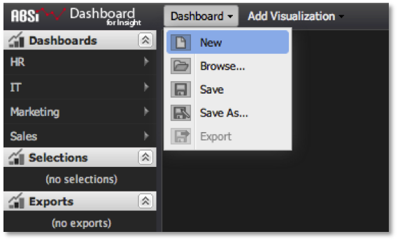
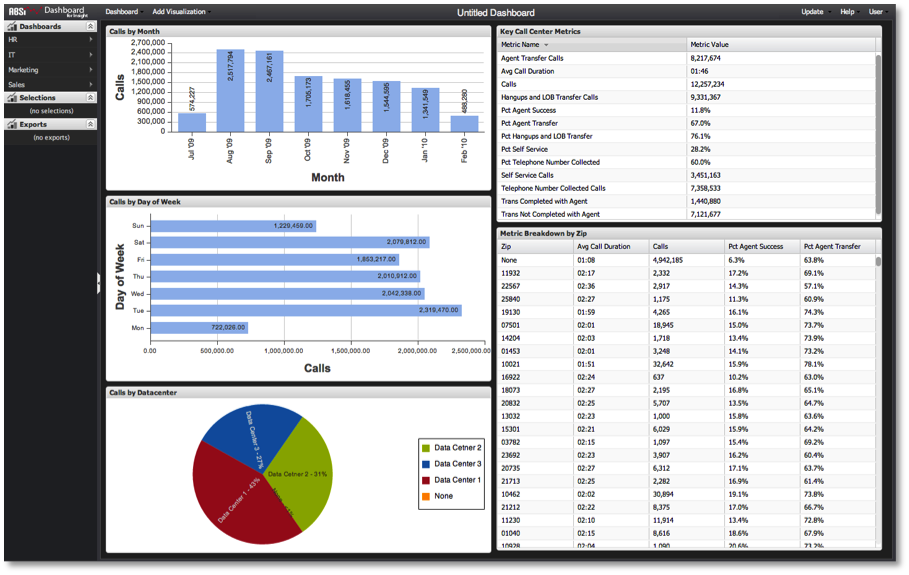

# Creating a Dashboard{#creating-a-dashboard}

Creating a dashboard is recommended even for short-term, ad-hoc analytical needs.

>[!NOTE]
>
>Read-only users cannot create dashboards. This section applies only to regular users and administrators.

Users can decide to create dashboards for several reasons:

* A new dashboard can be started from scratch for on-the-fly analysis with no intent of reusing or sharing the dashboard. 
* A new dashboard can be created for the purpose of performing your own personal analysis that you would like to save and reuse, but not share. 
* A new dashboard can be created, saved, and shared for you and the rest of the dashboard user population to access. Whatever the case, each scenario starts at the same point: a blank dashboard canvas.

>[!NOTE]
>
>Before starting to build out your dashboard, it’s a good idea to reduce your Query-to percentage to something low, such as 10 percent or 25 percent. This will pull samples of data from Data workbench much quicker than performing a complete query. Since these sampled results return much more quickly, it provides ideal responsiveness while framing out your dashboard and analysis. Once you’re ready to run queries to completion, you can update the query-to parameter to 100 percent. For adjusting query completion, see the [Query-to Parameter](../../../home/c-adobe-data-workbench-dashboard/c-dashboards/c-query-to-parameter.md#concept-33db106e28bc4108bca9e8d0a440d323).

To create a new dashboard, select **[!UICONTROL New]** under the Dashboard menu.

You will be presented with a blank dashboard canvas that is ready to have visualizations added and configured based on your analytic needs. As you work, nothing will be updated on the server until you save.

Next, decide what kind of data you want to display and how you want to display it. It generally helps to start with table visualizations to see the raw data, and then build out other charts to suit. For details on how to add and configure visualizations, see [Creating Visualizations](../../../home/c-adobe-data-workbench-dashboard/c-visualizations/t-creating-visualizations.md#task-c6f1d20fa2484aeeb9a8487625054ecf). After adding and configuring visualizations to build out the dashboard, you will end up with the following:

From this point you can simply perform your analysis and discard the dashboard, or you can choose to save the dashboard to the server for reuse and/or sharing. For information on how to interact with a dashboard to perform analysis, see the section [Making Selections within the Dashboard](../../../home/c-adobe-data-workbench-dashboard/c-making-selections-within-the-dashboard/c-making-selections-within-the-dashboard.md#concept-0989862de0044cc4bbfd7f4441275fc4). 
