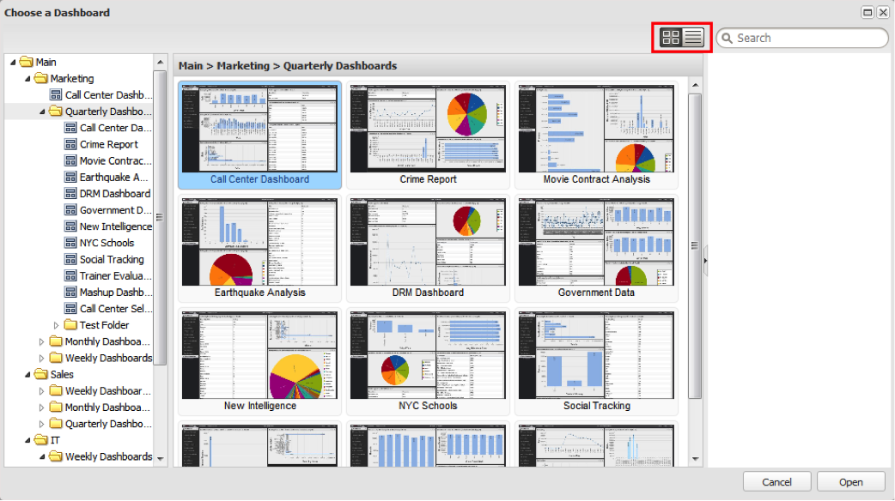
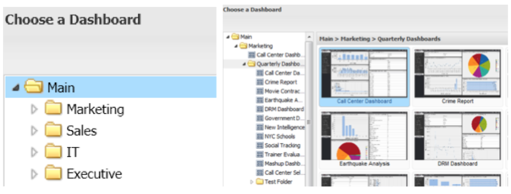
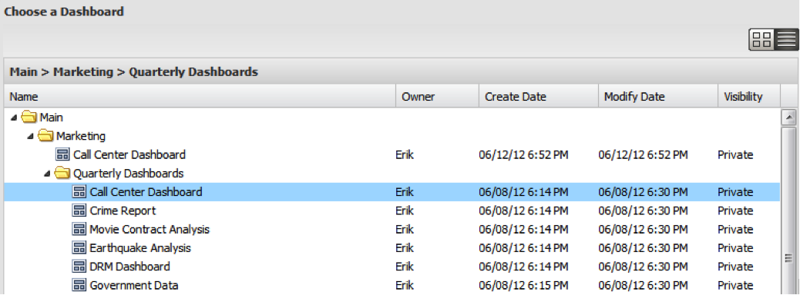

# Dashboard Browser Views{#dashboard-browser-views}

Explains the Thumbnail View and the List View.

There are two views that can be used to navigate dashboards within the Dashboard Browser: the Thumbnail View and the List View. The Thumbnail View provides thumbnails of dashboards as you browse, while the List View is a more detail-oriented table-based view of the available dashboards.

## Thumbnail View {#section-b522ce5e6e184ef9a0e1b9a42f7a9ae0}

The Thumbnail View provides a gallery of thumbnails that correspond with the dashboards for which you have access. If a thumbnail displays a default icon, please contact your administrator to have a thumbnail established for that dashboard. The icons to the left of the search bar allow you to toggle between Thumbnail and List Views.

In the thumbnail view, the left-hand navigation panel of the Dashboard Browser displays the folder hierarchy that organizes the storage of dashboards. To view the contents of a folder, click on the folder to show its contents as thumbnails in the center panel of the Dashboard Browser. If there are no dashboards saved in that level of the folder, the message “no dashboards in this location” will display in the center panel of the window.

You can also explore subfolders by clicking on the arrow to the left of the folder of interest. This will expand a list of subfolders and dashboards within the folder you selected. By selecting a folder that contains at least one dashboard, the center panel will display a thumbnail for each of the dashboards located at the level of that selection. The center panel title will also change to indicate the path of the selected folder.

You can then select the dashboard of interest by clicking on it. Once you have clicked on a dashboard thumbnail, the right-hand frame will populate with the details about the dashboard. The dashboard details contain a thumbnail view of the selected dashboard, its name, a brief description, the owner, creation date, last modification date, profile(s) used to compile the data, visibility controls, and offers a selection of operations.

## List View {#section-aa79d51168a7430ea2816413dc6cc73a}

The List View provides table-based information on the dashboards for which you have access. Each row in the List View’s table represents a unique dashboard. Clicking on column headers will allow you to sort the table by that column in either descending or ascending order.

Clicking on a dashboard entry will display the dashboard’s details in the right-hand panel of the dashboard browser. To switch between views, re-select the desired view option.
