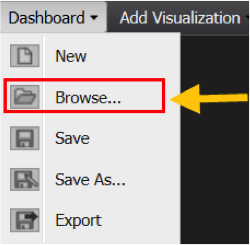
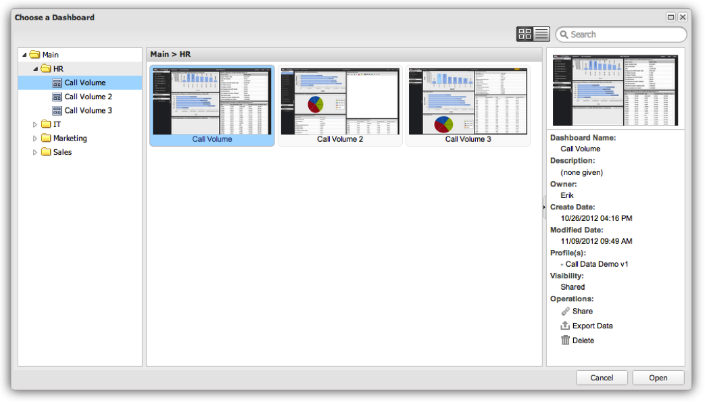

# Dashboard Browser{#dashboard-browser}

The Dashboard Browser facilitates browsing, searching, and opening dashboards that you and other members of your organization have created and saved.

 You can browse and access all dashboards that you have permissions to view (for more information on access controls, see section Access Controls). The Dashboard Browser works well when you need to find a dashboard but are uncertain about which one you need or where it resides. The Dashboard Browser is also useful for getting additional details and performing special functions on a given dashboard.

## Opening the Dashboard Browser {#section-10e158d738684219ab997ef050b675d7}

When you log into Adobe Data workbench dashboard, the Dashboard Browser will appear by default. You can also access the Dashboard Browser at any time by clicking on the Dashboard menu in the toolbar and selecting **[!UICONTROL Browse…]**.

