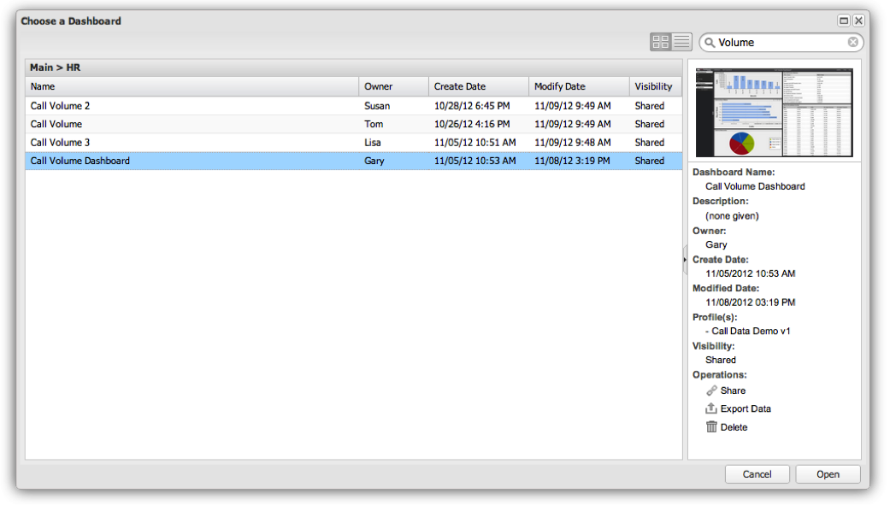
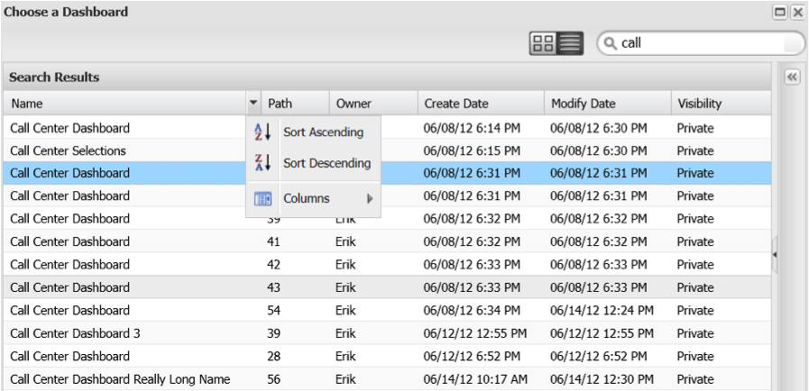
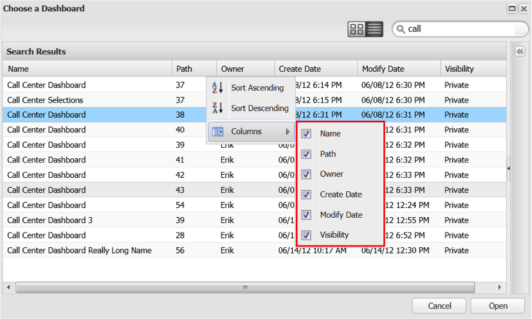

# Searching within the Dashboard Browser{#searching-within-the-dashboard-browser}

The Dashboard Browser also allows you to perform searches to find existing dashboards.

To perform a search, use the search box in the Dashboard Browser’s toolbar. Your search results will appear in the Dashboard Browser as you type. You can clear a search at any time by deleting the search text or clicking the **[!UICONTROL X]** icon in the search box.

You can also sort your results using the sort functions in each column header. Clicking on a column header will toggle sorting on that column. You can also access the sorting options using the drop-down menu on each column header.

This **[!UICONTROL Columns]** menu also allows you to modify visible columns in the dashboard list view. Here you can toggle the visibility of columns by selecting or deselecting the column(s) of choice.

## Details Panel {#section-e1e5a5a0f9cc4eb89b0b94764587ae9c}

The Dashboard Details Panel displays a dashboard’s detailed information along with a thumbnail version of the dashboard. Information found in the panel includes the dashboard’s name, a brief description, the owner and date of creation, the last date in which it was modified, and the profile(s) that were used to create the dashboard. The dashboard’s visibility (whether it is private or shared) is also available in this panel.
