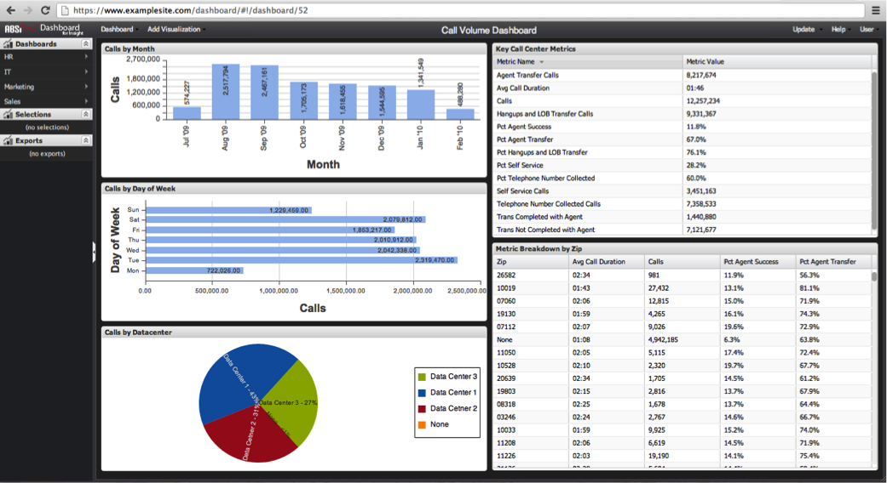

# Dashboard Hyperlink{#dashboard-hyperlink}

The third way that a dashboard can be opened is by using a dashboard’s hyperlink.

Each dashboard has a unique hyperlink that can be used to open the dashboard through the browser’s address bar. Dashboard hyperlinks can also be used for bookmarking and sharing via e-mail.

If you have a dashboard’s hyperlink, simply enter it into the browser’s address bar and navigate to the link. You’ll be directed to the dashboard site and prompted to log in (if not already logged in). Once logged in, the dashboard will load in the interface.

>[!NOTE]
>
>You will be prompted with a message if the dashboard no longer exists or you do not have proper permissions to access the dashboard.

