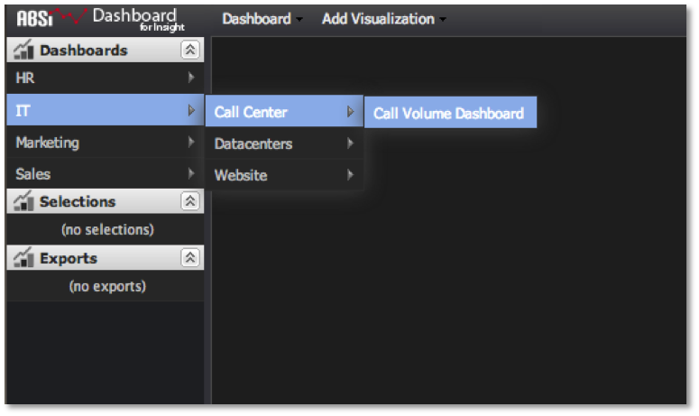

# Quick-Access Menu{#quick-access-menu}

One of the easiest methods to open a dashboard is by using the quick-access menu on the left-hand navigation panel of the dashboard interface.

Placing the cursor over a folder menu item (denoted by the right-facing arrow) will expand its contents and allow you to quickly navigate through the dashboard folder hierarchy to find your desired dashboard. Clicking on the dashboard’s menu item (denoted by the dashboard title and no right-facing arrow) will open the dashboard for viewing and analysis.

This method is ideal when you know the name and location of the dashboard you would like to open. If you’re unsure of the name and/or location of the dashboard, the Dashboard Browser will help you locate and open the dashboard.

