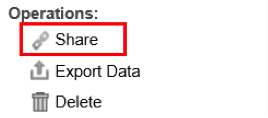
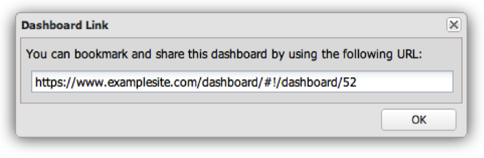
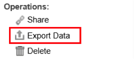
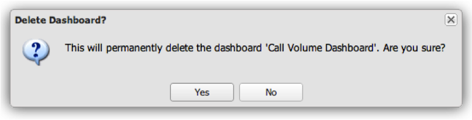

# Other Dashboard Functions{#other-dashboard-functions}

Special functions include sharing, exporting, and deleting dashboards and are performed from the details panel of a selected dashboard.

## Sharing a Dashboard Hyperlink {#section-16b592f157de404fb25bd2c739d2e2c1}

The **[!UICONTROL Share]** operation provides a URL that can be used to either bookmark the dashboard or mail a link for another user to access the dashboard. A Dashboard Link window will appear that provides you with the information needed to share the link to the desired dashboard.

>[!NOTE]
>
>Recipients of the link must also have access to the dashboard in order to view the dashboard.

## Exporting Dashboard Data {#section-ace2f5f8807548ee8436f5c1dc2cd9d2}

The **[!UICONTROL Export Data]** operation initiates an export of the selected dashboard to be saved as an Excel or CSV (Comma Separated Values) file.

## Deleting Dashboards {#section-adc10cb1b3174ff699c024ddc8f994fa}

The **[!UICONTROL Delete]** operation will delete a dashboard. To delete a dashboard, the user must be the owner of the dashboard or have administrator access. Clicking the Delete operation will display a window to confirm that you would like to delete the dashboard.

