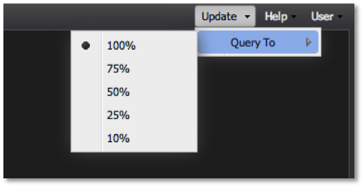
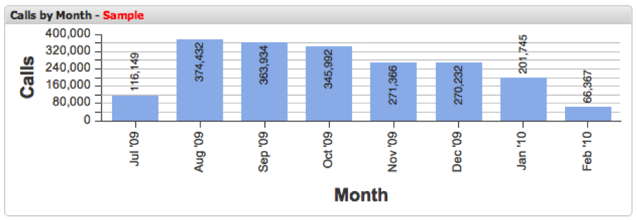

# Query-To Parameter{#query-to-parameter}

The dashboard allows you to visualize samples of data from Adobe data workbench versus querying your dataset to completion.

Since sample results are returned quickly, using a lower **[!UICONTROL Query To]** percentage feature facilitates quick dashboard creation and analysis until a full result is returned. The **[!UICONTROL Query To]** parameter can easily be adjusted at any time using the **[!UICONTROL Query To]** menu within the **[!UICONTROL Update]** menu of the toolbar.

Since running queries to 100 percent completion can take several minutes, it is recommended that you adjust the **[!UICONTROL Query To]** parameter to a lower value while building dashboards, or adding and configuring visualizations. It is also recommended to lower this value when fine-tuning your selections within a dashboard until you are sure you are ready to run the query to 100% completion.

>[!NOTE]
>
>An indicator will be shown in the header for each visualization that does not have a 100 percent complete query result.

