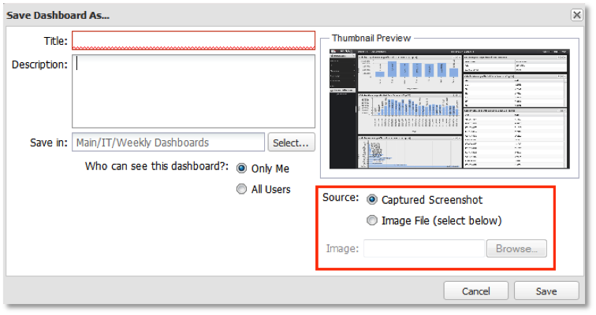

# Saving a Dashboard{#saving-a-dashboard}

1. To save a new dashboard, select either **[!UICONTROL Save]** or **[!UICONTROL Save As…]** from the Dashboard Menu at the top of the dashboard interface. For a new dashboard, both options have the same result.

   This launches the **[!UICONTROL Save New Dashboard]** window where you can enter a title, a brief description, and location to store the dashboard. 

   >[!NOTE]
   >
   >Dashboards can be either private or shared. If a dashboard is labeled **[!UICONTROL Private]** on the **[!UICONTROL Visibility]** field, only you (or a system administrator) can view and edit the dashboard. If a dashboard is labeled **[!UICONTROL Shared]** on the **[!UICONTROL Visibility]** field, every user of the system can view and edit the dashboard.

1. Under the **[!UICONTROL Source]** field, choose an image thumbnail to represent the dashboard. By default, a screenshot of the dashboard will be taken and used as the thumbnail for the dashboard.

   This thumbnail will be used if the **[!UICONTROL Captured Screenshot]** option is selected. If you would like to use another image file, select the **[!UICONTROL Image File]** option and choose the image you would like to represent the dashboard. 

   >[!NOTE]
   >
   >If your browser does not support screenshot capture, then a default screenshot will be used. In this case you may wish to select an image file to represent the dashboard instead.

   

1. Click **[!UICONTROL Save]** to save the dashboard to the server. You will be the owner of this dashboard and will have full control over it in the future.
