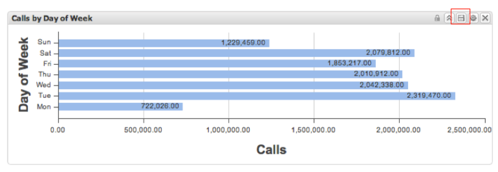
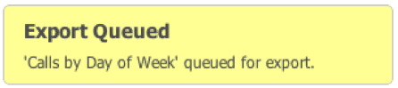
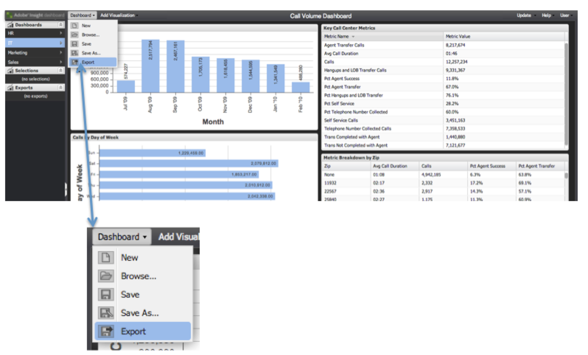
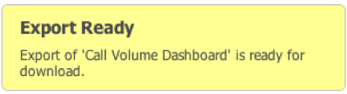
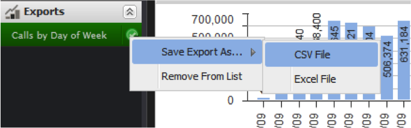
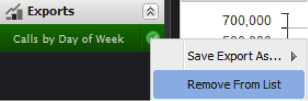

# Exporting Data{#exporting-data}

Shows 3 ways of exporting data, and how to retrieve exports.

Data can be exported from the dashboard in three ways.

First, you can export data from an individual visualization. Second, you can export your current working dashboard, including any configurations and selections you’ve made. Third, you can export a saved dashboard without opening it.

Exports are performed using a two-step process. First, exports are queued on the server using one of the three methods above. The status of the export will be displayed in the **[!UICONTROL Exports]** menu as the export is being prepared. Next, when exports are ready, you can download the data in either CSV or Excel format.

Exports may take several minutes, but you can continue to use the application during an export.

## Exporting Visualizations {#section-46b74b46c2eb44129c8b85a9eabd2304}

To export data from a visualization, click **[!UICONTROL Save]** in the visualization’s tool menu.

Your export will be initiated on the server and an export indicator will be added to the Exports Menu.

## Exporting Dashboards {#section-27329f2a5fed44b49deb26dc5164531f}

To initiate a data export from a working dashboard, select **[!UICONTROL Export]** from the **[!UICONTROL Dashboard]** menu.

Your export will be initiated on the server and an export indicator will be added to the Exports Menu.

## Exporting Saved Dashboards {#section-e989f7b16e25479ab77454f2c34471ba}

To initiate a data export from a saved dashboard, use the Dashboard Browser. Within the Dashboard Browser, browse to your desired dashboard and select it so the dashboard’s details appear. In the right-hand details panel, under the **[!UICONTROL Operations]** section, select **[!UICONTROL Export Data]**.

Your export will be initiated on the server and an export indicator will be added to the **[!UICONTROL Exports]** menu 
.  

## Retrieving Exports {#section-0f03c5321c804867b7c72cf92f6f67d0}

When an export is complete, a popup notification appears to notify you that the export is ready.

To retrieve the export, use the **[!UICONTROL Exports]** menu. Clicking the green checkmark to the right of the desired export’s item will show a drop-down menu. Within this menu, under the **[!UICONTROL Save Export As…]** submenu, select the appropriate menu option to download the export in either CSV or Excel format.

Your browser’s file download process now starts.

Exports are not removed automatically, so you can easily download the export in each format. You may remove exports from the **[!UICONTROL Exports]** menu in the left navigation panel. Otherwise, they will automatically be removed when you log out.

To remove an export from the **[!UICONTROL Export List]**, click the checkmark to the right of the export title and select **[!UICONTROL Remove From List]**.

