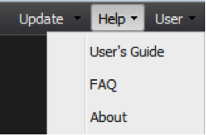

# Help Menu{#help-menu}

Using the Help drop-down menu, you can access the dashboard product documentation

 

* **[!UICONTROL User’s Guide]** - Selecting the User’s Guide option from the Help drop-down menu directs you to a web link in which you can access this document at any time. 
* **[!UICONTROL FAQ]** - The FAQ provides you with a list of frequently asked questions and answers specific to the dashboard. This section serves as a quick reference guide for common user issues. 
* **[!UICONTROL About]** - The About portion contains system information, including the version number and legal agreement. It also contains your user-agent string, which is a useful piece of information to provide when seeking technical support.

## Additional Support {#section-c211c01637984e10918fd2367c097b60}

For further support regarding technical or software performance issues, contact your system administrator. To facilitate the resolution process, be prepared to provide the following information:

* Your Adobe data workbench dashboard user name 
* Web browser type and version 
* Operating system name and version 
* Dashboard version number 
* Detailed explanation of the issue you are experiencing 
* Screen shots of issue (if possible)

