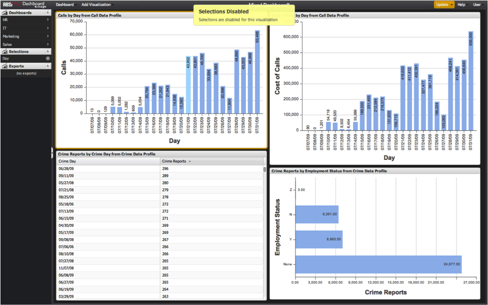

# Cross-Profile Selections{#cross-profile-selections}

You can visualize data from multiple profiles in one dashboard.

In some cases, selections from one visualization can also be applied to visualizations from another profile. For example, if you create visualizations from a **[!UICONTROL Call Center]**profile and a **[!UICONTROL Website Traffic]** profile on one dashboard, you could select a target month to have the data in all visualizations simultaneously segmented on that month, despite being entirely different datasets.

When visualizations from multiple profiles exist in a dashboard, you may make a selection in a visualization if that visualization’s dimension also exists on all other profiles represented on the screen. However, selections will be disabled if a dimension is not found globally across all other visualizations on the screen, and users will see a **[!UICONTROL Selections Disabled]** message.

>[!NOTE]
>
>Even though dimensions may share the same name across multiple profiles, they may not have the same meaning. It is important to investigate each dimension to determine whether it is appropriate to use it to make selections across multiple profiles.

