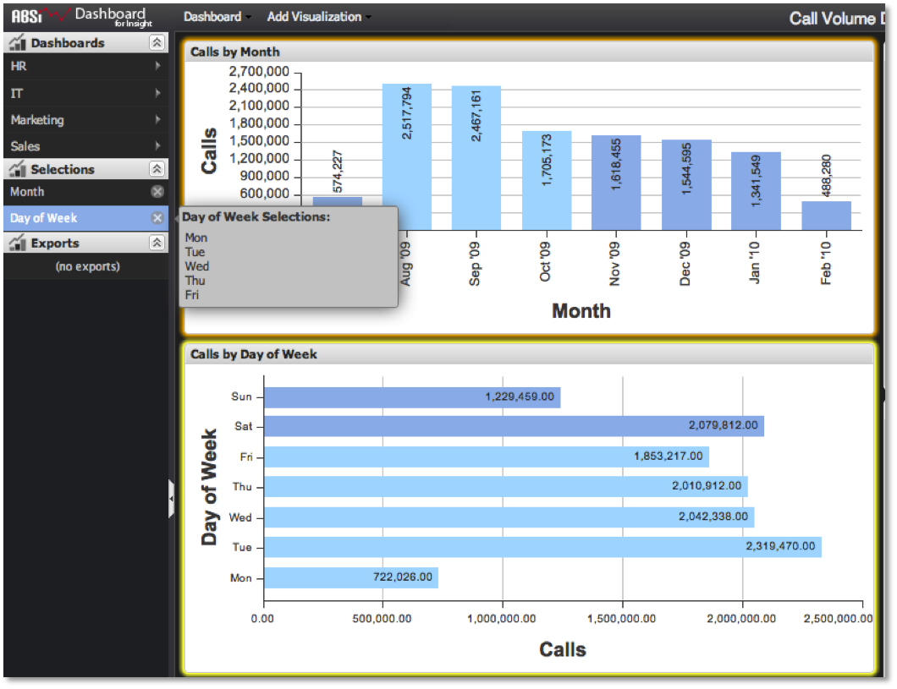

# Determining What's Selected{#determining-what-s-selected}

There are two ways to determine which selections have been made within a dashboard.

* First, all selections that have been made on the dashboard will be represented by an item in the **[!UICONTROL Selections]** menu. Each group of selections from a visualization will appear as one item in the list. These will be labeled with the corresponding dimension name (i.e. ‘Day’, ‘Month’, etc.). Placing the mouse cursor over this entry will display a popup that identifies exactly which metric values have been selected.

  

* Another feature to help identify the selections that have been made is visualization highlighting. Any visualization that has a selection will be outlined in orange. Also, placing the mouse cursor over a selection item will highlight its corresponding visualization in bright yellow, showing the user where the selection came from.

