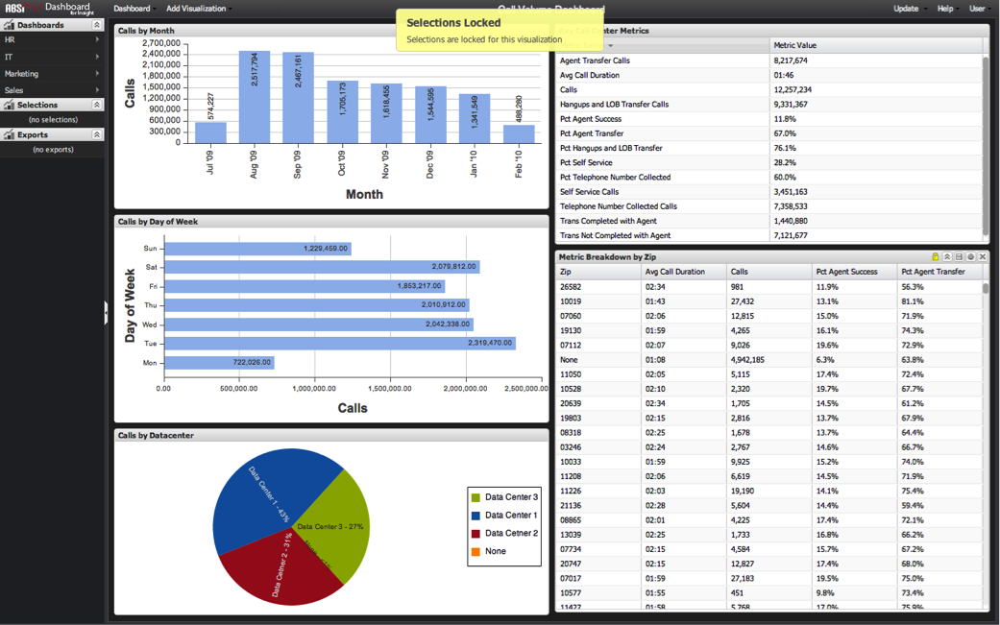

# Locked Selections{#locked-selections}

Selections within one or more visualizations on a dashboard can be locked to preserve current selections and prevent further alteration.

Locking visualizations is useful for guiding analysis since certain items can be pre-selected and permanently applied to the entire dashboard. This provides an on-screen visual indicator of what is being filtered without allowing it to be altered.

Locking is also useful for guiding analysis by only allowing users to select on visualizations that are relevant to the analysis that the dashboard is aiming to achieve. For example, in the sample dashboard below, drilling down to the zip code level may be beyond the scope of high-level call volume analysis. In this case it may make sense that the **[!UICONTROL Metric Breakdown by Zip]** table be locked and have selections only allowed on the Month, Day of Week, and Datacenter visualizations.

If you try to make selections on a locked visualization, you will see a message indicating that the visualization is locked. You will also see a gold lock icon in the visualization header when the mouse cursor is hovered over the locked visualization.

As with any selection, locked selections are preserved when a dashboard is saved and remain active when a dashboard is loaded. For more information see [Locking and Unlocking Visualizations](../../../home/c-adobe-data-workbench-dashboard/c-visualizations/c-manipulating-visualizations/c-locking-and-unlocking-visualizations.md#concept-9215bcdd5bb44dee8d92ef0cc82f44d2). 
