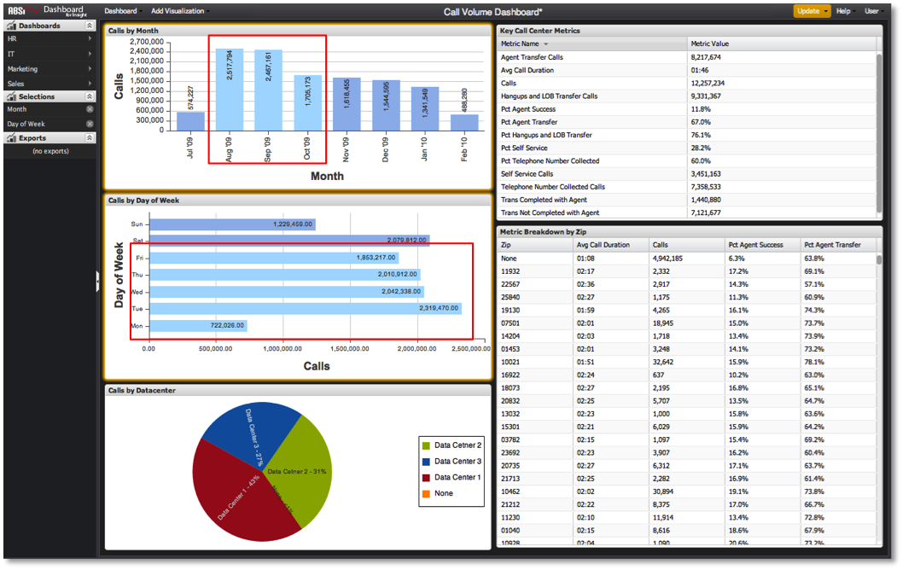

# Making Selections within the Dashboard{#making-selections-within-the-dashboard}

Data within a dashboard can easily be segmented and explored by the use of selections.

 Selections are made by clicking certain elements within visualizations to identify how the data in the dashboard should be segmented. Making a selection in one visualization will segment the data being represented in the other visualizations within the dashboard. Any number of selections can be made, adjusted, or removed at any time, and encourages the user to interact with the data to derive analytical information.

When saving a dashboard, the state of any selections will be preserved at the time of save. Similarly, when a dashboard is loaded, any selections that were preserved during the save will be made effective when the dashboard is loaded.

Selections can be made by clicking on one or more data elements within one of a dashboard’s visualizations. Data elements are represented by things like bars in bar charts, columns in column charts, rows in a table, and so on. Selections are highlighted as they are made, and making selections within a visualization will give the visualization an orange border. The exact method for making selections depends on the type of visualization being used.

For each selection that has been made from a visualization, an entry will also appear in the Selections Menu. This entry is listed using the selected dimension name, with one selections entry appearing per visualization.

>[!NOTE]
>
>Visualized data is not automatically updated each time a selection is made. Rather, after you have made your desired selections, you must initiate an update in order to segment the data and update your visualizations.

