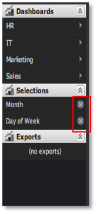
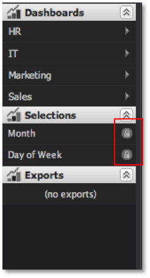

# Removing Selections{#removing-selections}

Selections can be removed at any time.

 Just click the **[!UICONTROL X]** icon inside the corresponding selections item in the Selections Menu.

If a visualization’s selections are locked, you will see a small padlock icon replacing the **[!UICONTROL X]** icon. Locked selections cannot be removed without unlocking the visualization first.

