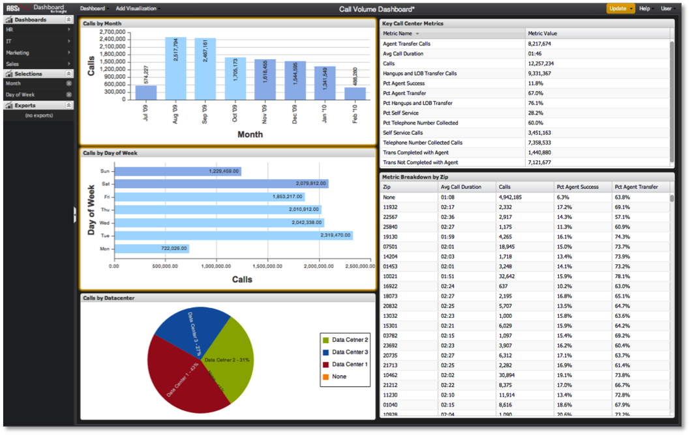

# Applying Selections{#applying-selections}

Selections are not automatically applied to the dashboard’s data results.

1. Finished making your desired selections and click **[!UICONTROL Update]**.

   If the **[!UICONTROL Update]** button is orange, this indicates that you must click it to apply some change in the dashboard’s selections. This feature allows you to make multiple selections on the screen and frame out your analytical questions without having a query initiated every time you make a change.

   

