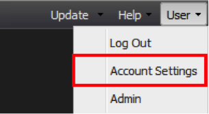
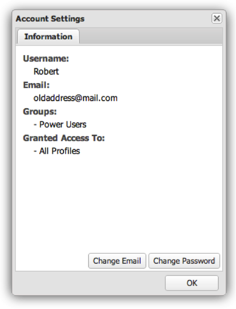

# User Account Management{#user-account-management}

Information on how to access your account settings and change your password.

## Accessing your Account Information {#section-7c39e79d8d6445059c9a6237e140bc6a}

To access your account information, select Account Settings from the User menu.

A window will appear that details your account information. This includes your username, e-mail address, group membership, and the data profiles available to you. To verify your user profile has been configured correctly and that you have access to all your data profiles, you can review the profiles listed in the Granted Access To section. If you are missing data profiles, contact your administrator.

## Changing your Password {#section-4ba1ee3d5d584455a1a77e992b7b876c}

To change your password, first access your account information. To access your account information, select **[!UICONTROL Account Settings]** from the **[!UICONTROL User]** menu. Click **[!UICONTROL Change Password]**. 
