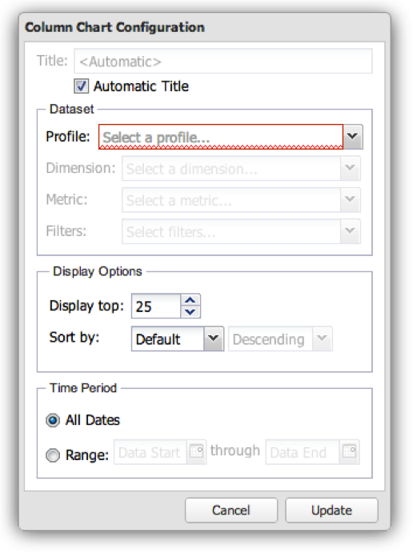
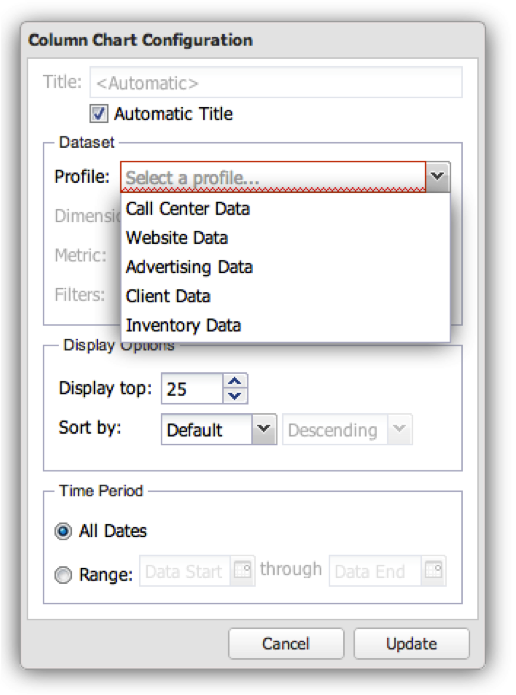
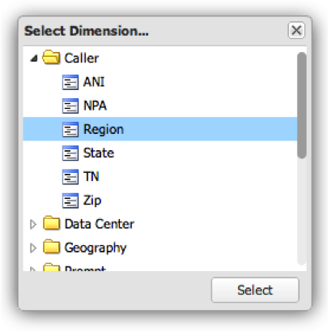
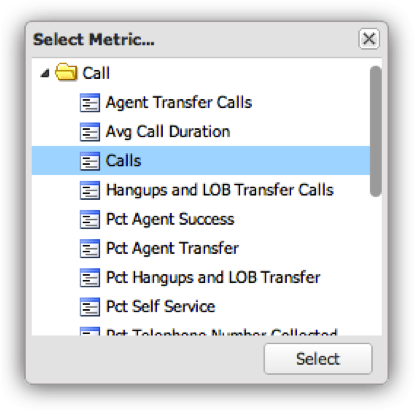
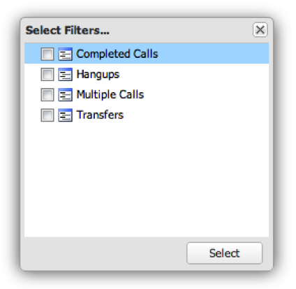
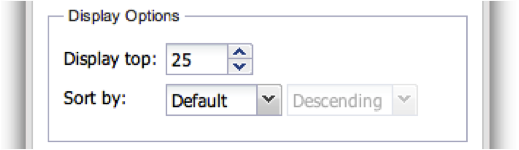
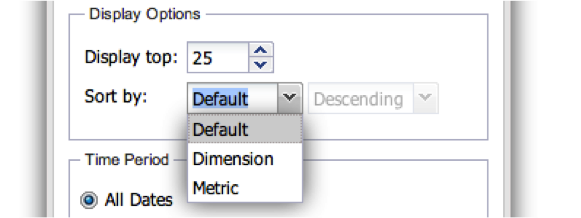
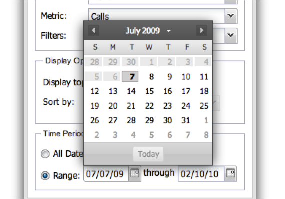

# Configuring Visualizations{#configuring-visualizations}

Shows how to configure Title, Profile, Dimension, Metric, Filter, Display Top, Sort By, and Time Period.

Each visualization on the dashboard canvas has its own configuration. When a visualization is first added to the dashboard canvas, its configuration window will appear automatically. Once configured, the visualization can be modified at any time by clicking the gear icon in the upper right-hand portion of the visualization window.

>[!NOTE]
>
>Configuration options vary slightly depending on the type of visualization being displayed.

## Visualization Title {#section-0414844283d745ae912e85f8ea14a51d}

This field allows you to customize the title displayed at the top of the visualization. By default the title is set to **[!UICONTROL Automatic Title]**, which will automatically generate a title for the visualization window. By clearing the **[!UICONTROL Automatic Title]**button, you may place any title in this field. (This field applies to all visualizations.)

## Profile {#section-16eb0def0a2d4eb289f5bb9200d14754}

This field allows you to select which profile you wish to visualize data from. Clicking on the dropdown menu will provide you with a list of profiles for which you have access. (This field is not applicable for Rich Text visualizations.)

Profiles are data sets defined within Data workbench that contain data about a certain domain, along with the dimensions, metrics, and filters that accompany the data. A profile is often designed to fulfill a specific purpose (such as marketing or website traffic).

>[!NOTE]
>
>You can see only the profiles for which you have been granted access. For more information see Access Controls.

## Dimension {#section-4ebb8c4308a146c3a35c7ac7ab6b579f}

Lets select the dimension you would like to visualize. The list is populated from the list of dimensions available from the profile selected in the Profile field. Click on the desired dimension and then click the Select button. (This field is not applicable for Metric Legends and Rich Text visualizations.)

Dimensions are categories of like data types. For example, the Days of Week dimension is composed of the following data elements: Sunday, Monday, Tuesday, Wednesday, Thursday, Friday, and Saturday. Dimensions show what is being measured.

## Metric(s) {#section-7d46f2f1b9fe4e539b5eb0a0dc6e5ad3}

Lets you select the metrics to visualize. Metrics are quantitative objects and are defined by some quantifiable expression. For example, Page Views per Session is derived from the expression of the count of Page Views divided by the count of Sessions. Metrics answer the question of “how many?”

Single-metric visualizations have a single-metric selection window:

Multi-metric visualizations have a multi-metric selection window:

The list is populated from the list of metrics available from the profile selected in the Profile field.

Click on the desired metrics and then click **[!UICONTROL Select]**. (This field is not applicable for Rich Text visualizations.)

## Filters {#section-f8619ae2f8e54735a2c1b0fbb8bb1281}

Select the filters you would like to apply to your visualization. The filter selection window allows you to select multiple filters from the filter list. The list is populated from the list of filters available from the profile selected in the Profile field. Click on the desired filter and then click **[!UICONTROL Select]**. 

>[!NOTE]
>
>Filters applied here are only applied to their corresponding visualization, not the entire dashboard. This is useful for comparing the results of two different visualizations with different filters applied.

## Display Tops {#section-7ce71cb0fa6446998b710b427e68b133}

Visualizations in the dashboard are not designed to display the entirety of the data. Rather, they allow you to specify the number of dimension records you would like to display on the visualization. This displays the top number of dimensions depending on the sort-by value given below. (This field is not applicable for Tables, Metric Legends, and Rich Text visualizations.)

## Sort By {#section-f686249e20444359bff87c00cc2ba29f}

This allows you to specify how the data should be sorted when it is displayed within the visualization. (This field is not applicable for Tables, Metric Legends, and Rich Text visualizations.) There are multiple sorting options:

* **[!UICONTROL Default]** - Return the data unsorted based on the sort order stored in data workbench. This is the option to use for time-based data such as hour, day, week, or month. 
* **[!UICONTROL Dimension]** -Sort the data based on the alphanumeric dimension value. 
* **[!UICONTROL Metric]** - Sort the data based on the metric value and is good for quickly visualizing the top dimensions. 
* **[!UICONTROL Descending]** - Sort the data in descending order. 
* **[!UICONTROL Ascending]** - Sort the data in ascending order.

## Time Period {#section-6220368e9e524b46ac735add6ab9edb0}

This visualization allows you to specify the desired start and/or end date of the data to display within the visualization.

Selecting **[!UICONTROL All Dates]**displays the entire date range available in the profile.

Selecting **[!UICONTROL Range]** displays only the data that falls within a specified range. To enter the date range, you can type in the beginning and/or end date, or use a calendar input by selecting the calendar icon.

(This field is not applicable for Rich Text visualizations.)

>[!NOTE]
>
>Date ranges applied here are only applied to their corresponding visualization, not the entire dashboard. This is useful for comparing the results of two different visualizations with different date ranges applied.

