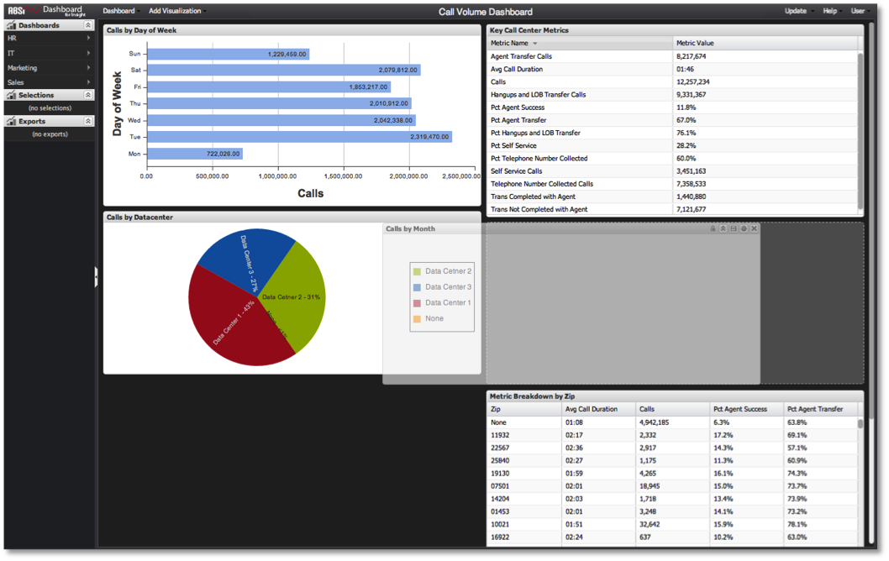

# Moving Visualizations{#moving-visualizations}

Visualizations can be easily moved and rearranged within the dashboard canvas.

 To move a visualization, simply click the visualization’s title bar, drag the visualization, and drop it in another location on the dashboard canvas. The dashboard canvas will assist in positioning the visualization by making room for it at the desired location. Existing visualizations will automatically be shifted up or down to make room for the visualization being moved to avoid overlapping.

