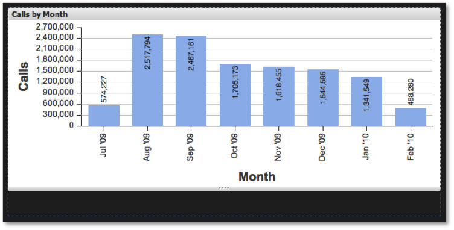

# Sizing Visualizations{#sizing-visualizations}

In addition to expanding and collapsing a visualization, you can also resize them.

 Just use the resize handle at the bottom of the visualization window. By hovering over the bottom edge of a visualization window, you can click-and-drag to make the window taller or shorter on the dashboard canvas. Any other visualizations within the dashboard will automatically be repositioned to fit the new size of the resized visualization. The width of visualization is fixed relative to the width of the browser and cannot be manipulated.

