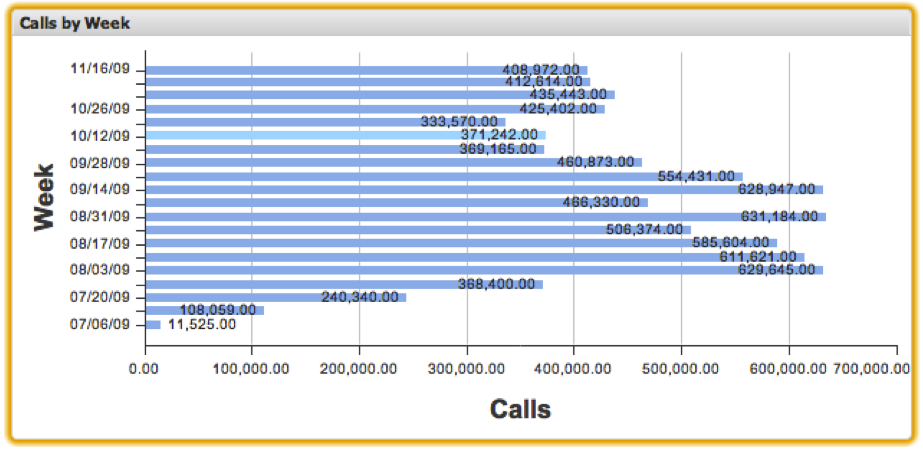

# Bar Charts{#bar-charts}

Bar chart visualizations allow you to visualize metric and dimension data with each data element represented as a horizontal bar on the chart. Bar charts allow up to 200 unique data elements to be displayed on the chart at once. The dimension values are labeled along the y-axis, while the metric increments are labeled along the x-axis. The bar for each dimension value is labeled with its exact metric value.

