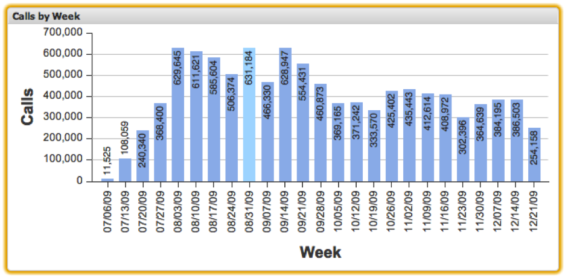

# Column Charts{#column-charts}

Column chart visualizations allow you to visualize metric and dimension data with each data element represented as a vertical column on the chart. Column charts allow up to 200 unique data elements to be displayed on the chart at once. The dimension values are labeled along the x-axis, while the metric increments are labeled along the y-axis. The column for each dimension value is labeled with its exact metric value.

