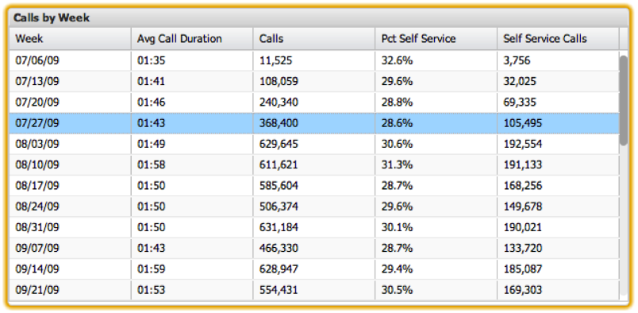

# Tables{#tables}

Tables are the most detail-oriented visualizations available in the dashboard application. Tables allow you to visualize metric and dimension data with each data element represented as a row in a table. One column holds the dimension values, while the other columns contain the corresponding metric values. Multiple metrics can be displayed, and there is no restriction on the number of dimension values that can be displayed in a table. All values for a selected dimension that exist in the data workbench data will be displayed in the table.

Column order can be rearranged by clicking-and-dragging one column header to another location in the column header area. Sorting can be performed at any time by clicking on the appropriate column header. Clicking the column header again will reverse the sort order.

Selections can be made in tables by clicking a particular row. Pressing and holding the **[!UICONTROL Control]** key will retain selections as you click additional items. Pressing and holding the **[!UICONTROL Control]** key when clicking will also toggle the value of a selection. This is useful for removing just one selection from a group of already selected items. A range of rows can be selected by first clicking a row to select it, then pressing the **[!UICONTROL Shift]** key while clicking the last row.

