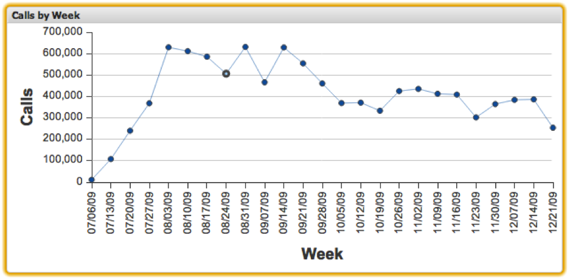

# Line Charts{#line-charts}

Line chart visualizations allow you to visualize metric and dimension data with each data element represented as a point on an x-y axis, and lines connecting adjacent points. Line charts allow up to 200 unique data elements to be displayed on the chart at once. The dimension values are labeled along the x-axis, while the metric increments are labeled along the y-axis. Placing the mouse over a point in the line chart will display the exact metric value at that point.

Selections can be made in line charts by clicking a particular point. Pressing and holding the Alt key will retain selections as you click additional items. Pressing and holding the Alt key when clicking will also toggle the value of a selection. This is useful for removing just one selection from a group of already selected items.

