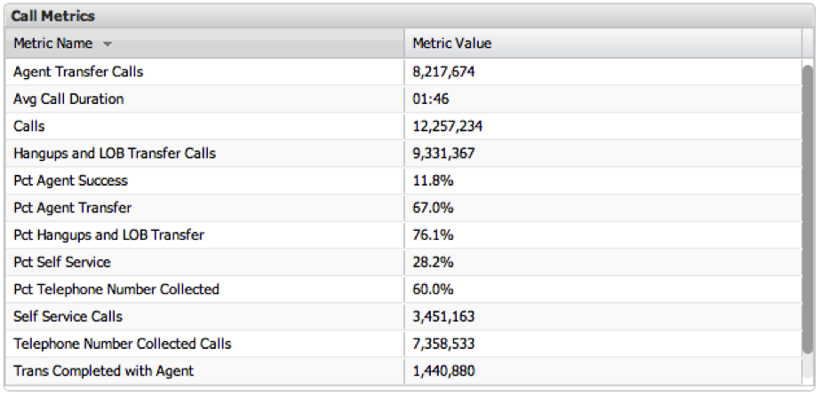

# Metric Legends{#metric-legends}

Metric legend visualizations allow you to display metric totals in a tabular format. The first column holds the metric name, while the second column holds the metric value. A scrollbar will be displayed in the event that all the rows cannot be displayed on the window at once.

Selections cannot be made within the metric legend since no specific dimension value is being displayed.

