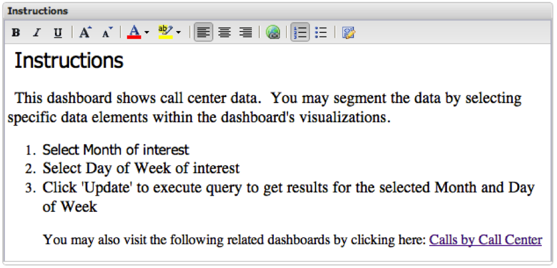

# Rich text{#rich-text}

Rich text visualization allows you to embed text-based information within the dashboard. This is useful for providing descriptions, hyperlinks, or instructional information. The text formatting toolbar at the top of the Rich Text window allows you to manipulate the format of text within the window body.

To add text to the rich text window, place the cursor within the body of the rich text window and begin typing. To edit text within the rich text window, use the text formatting toolbar at the top of this window. 
