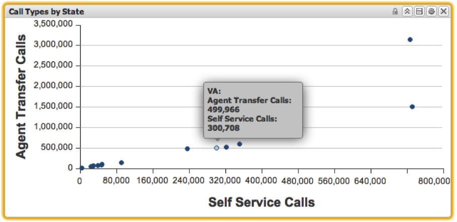

# Scatter Plot{#scatter-plot}

Scatter plot visualizations allow you to visualize two metrics against a dimension, with each data element represented as a point on an x-y axis. Scatter plots allow up to 200 unique data elements to be displayed on the chart at once. The first metric’s increments are labeled along the y-axis, while the second metric’s increments are labeled along the x-axis. Placing the mouse over a point in the line chart will display the exact value at that point.

Selections can be made in scatter plots by clicking a particular point. Pressing and holding the **[!UICONTROL Alt]** key will retain selections as you click additional items. Pressing and holding the **[!UICONTROL Alt]** key when clicking will also toggle the value of a selection. This is useful for removing just one selection from a group of already selected items.

