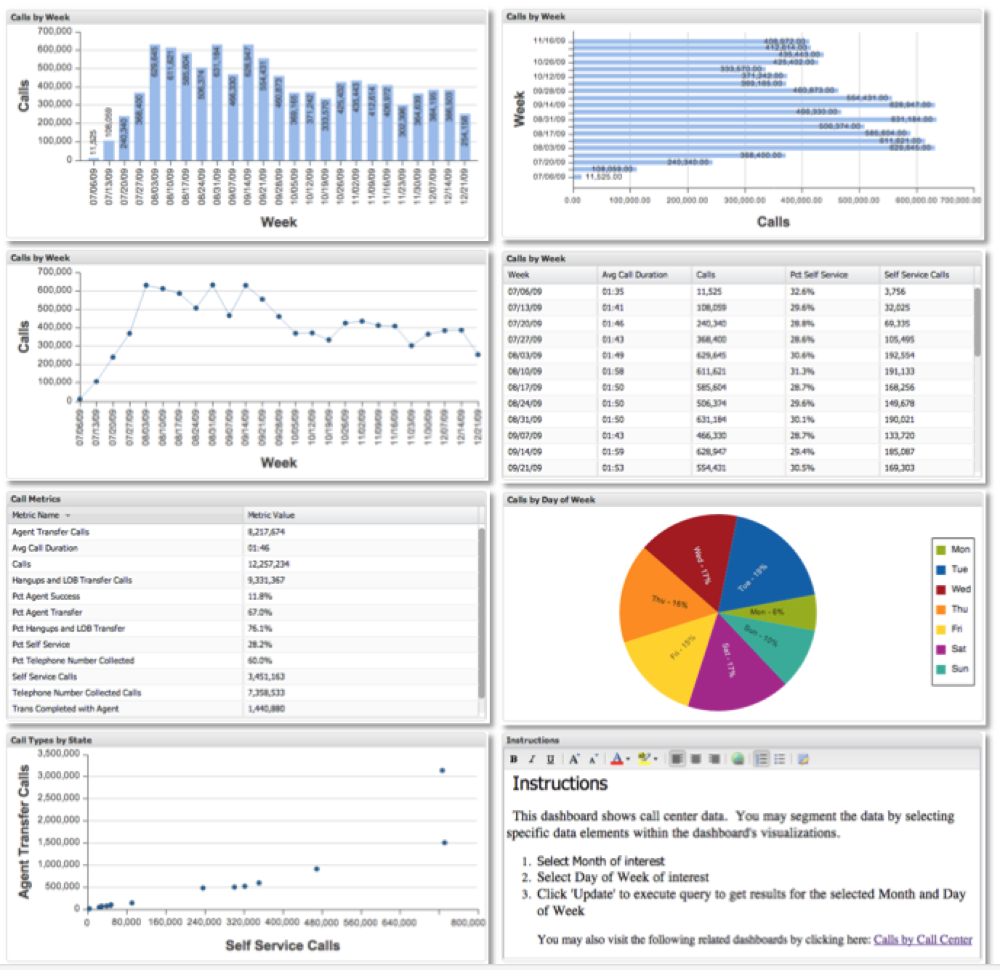

# Visualization Types{#visualization-types}

Introduces the eight different visualization types.

When selecting a visualization, it is important to carefully consider the dimensions and metrics you are visualizing and how the data can be visualized most effectively. For example, some visualizations have limitations on the quantity of data that can be displayed at once.

There are eight different visualization types that can be used to visualize and analyze your data: Bar Charts, Column Charts, Line Charts, Pie Charts, Tables, Metric Legends, Scatter Plots, and Rich Text.

