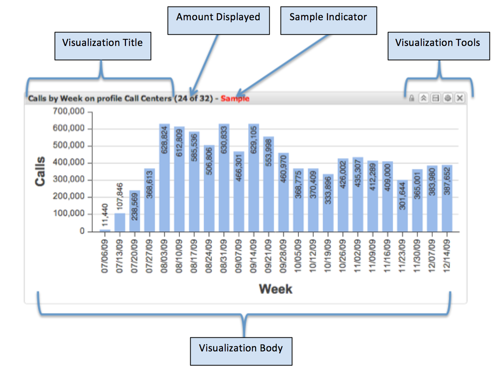

# Visualizations{#visualizations}

Visualizations are elements added to the dashboard canvas and configured to display various metric and dimension-based data.

All dashboards are composed of one or more visualizations. Each visualization can be created, removed, resized, and reconfigured independently of all other visualizations on the dashboard canvas.

Visualizations are also interactive, allowing users to quickly segment data by making selections on one or more data elements within the visualization. Selections made within one visualization will dynamically apply filters in real-time to other visualizations on the canvas. This renders the same data across all visualizations on the canvas.

There are eight different types of visualizations. Each one can be added, resized, configured, and removed independently of any other visualization. Visualizations display data defined in data workbench by a data workbench architect.

The eight types of visualizations available include:

* Column Charts 
* Bar Charts 
* Line Charts 
* Tables 
* Metric Legends 
* Pie Charts 
* Scatter Plots 
* Rich Text

## Visualization User Interface {#section-54a73865f00742268340cf9123d6c590}

The header portion of the visualization contains the visualization title and visualization tools, which vary depending on the type and state of the visualization. The body of the visualization contains the content, and is dependent on the type and configuration of the visualization being displayed. The visualization tools only appear when the mouse enters the visualization window. Otherwise they are hidden.

* Visualization Title. Describes this visualization. The title is automatically generated or manually overridden with a custom title. 
* Amount Displayed. For the dimension being visualized, displays the amount of data shown versus the total amount available. 
* Sample Indicator. Shown when the data visualized is a sample and not a 100% complete query result. 
* Visualization Tools. Performs specific operations on the visualizations. Tools available depend on the visualization type, state, and current user permissions. 
* Visualization Body. Displays the data of the visualization as configured. This area is interactive and depends on the type of visualization being displayed.

