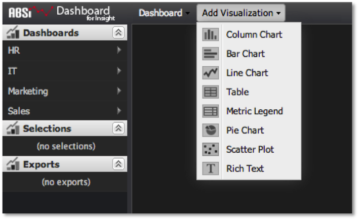

# Creating Visualizations{#creating-visualizations}

Steps to add a visualization to the dashboard canvas.

1. Go to the **[!UICONTROL Add Visualization]** menu at the top of the dashboard interface. You will see a list of available visualizations that can be created.

   

1. Select one of these menu items to create a new empty visualization and add it to the dashboard canvas.

   The visualization’s configuration dialog opens automatically to allow you to configure the visualization. See [Configuring Visualizations](../../../home/c-adobe-data-workbench-dashboard/c-visualizations/c-configuring-visualizations.md#concept-edc3c7270ffe429c9aab8ceca429b570) for details on how to configure the visualization. 

   >[!NOTE]
   >
   >Cancelling the initial configuration window removes the visualization from the dashboard canvas.

