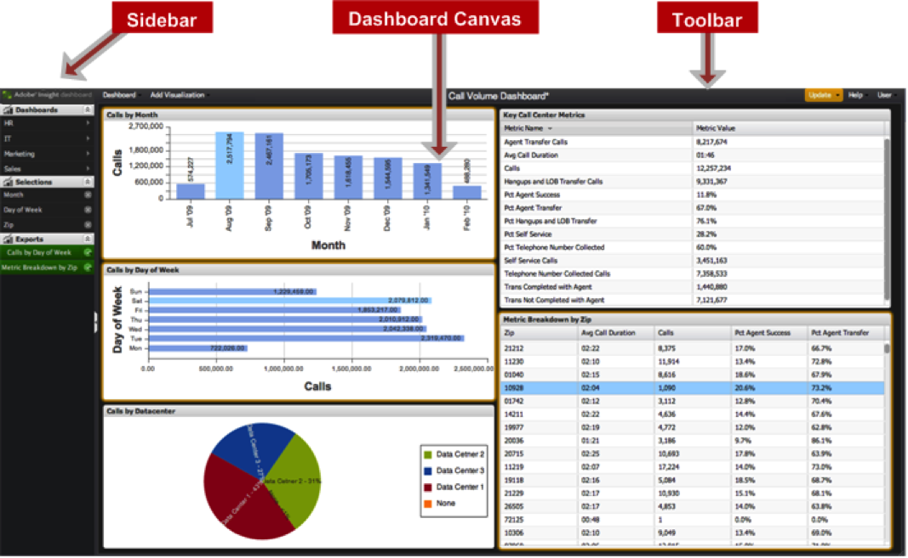

# Dashboard User Interface{#dashboard-user-interface}

The data workbench dashboard includes a Sidebar and Toolbar with feature menus and a Dashboard Canvas where you display data visualizations.

 

## Dashboard Canvas {#section-39c9352f5e8d407e8d76c7f2e6267b3d}

The Dashboard Canvas is the area of the interface used to create and interact with visualizations. 

|  Term  | Definition  |
|---|---|
|  Visualizations  | Rendered data defined graphically based on a set of configured criteria. Multiple visualizations make up a dashboard.  |

## Sidebar {#section-12e155c782e74851b0dbaa00c40deb8c}

The left sidebar provides quick access and visibility for defined menus: 

|  Menu  | Definition  |
|---|---|
|  Quick-access Menu  | A fly-out menu to quickly open dashboards.  |
|  Selections Menu  | Lists any current selections within the dashboard, providing additional details and the ability to remove selections at any time.  |
|  Exports Menu  | Lists any pending or completed exports, providing the ability to retrieve the export when complete.  |

## Toolbar {#section-f1c7d5b7fb37473f93cc533a7376c167}

The top toolbar provides access to these specific menus. It also displays the title of the dashboard currently open. 

|  Menu  | Definition  |
|---|---|
|  Dashboard Menu  | A drop-down menu for opening, creating, saving, and exporting dashboards.  |
|  Add Visualization Menu  | A drop-down menu for adding visualizations to the dashboard.  |
|  Dashboard Title  | Displays the title of the current dashboard.  |
|  Update Menu  |Clicking the **[!UICONTROL Update]** indicator will update the current dashboard, taking into account any new selections and/or configuration changes. The menu provides the ability to adjust the **[!UICONTROL Query-to]** parameter, along with some advanced functions for administrators.  |
|  Help Menu  | This drop-down menu is used to access the User’s Guide, FAQ, and About section of the application.  |
|  User Menu  | A drop-down menu for logging out, accessing account settings, and accessing the administration area (for administrators only).  |
