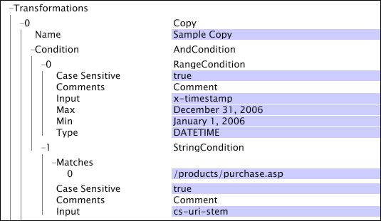
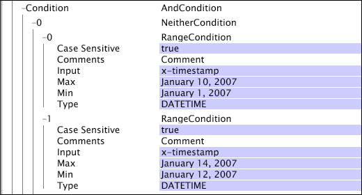
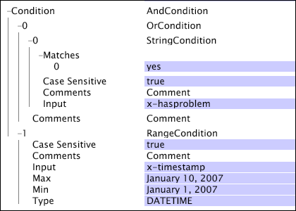

# Boolean Operations{#boolean-operations}

The Boolean operations combine the results of the test operations, which function as children of the boolean operations.

 For information about the test operations, see [Test Operations](../../../../home/c-dataset-const-proc/c-conditions/c-test-ops/c-test-ops.md#concept-c4bf6cb9e7a94cc7ac49ca9b0b1a2144). When you define a [!DNL boolean] operation, you can define zero or more children for the operation.

**To add a child condition to a Boolean operation**

1. Right-click the name or the number corresponding to the [!DNL Boolean] operation. 
1. Click **[!UICONTROL Add new child]** and choose one of the available condition types to add. 
1. Repeat steps 1 and 2 until you have added all of the desired child conditions for the [!DNL Boolean] operation.

   >[!NOTE]
   >
   >When you right-click the name or the number corresponding to a [!DNL Boolean] operation, you see the [!DNL Add new sibling] menu option. A sibling is another condition at the same relative position in the condition hierarchy as the [!DNL Boolean] operation that you right-clicked. Adding a new sibling for a [!DNL Boolean] operation is the same as adding a new condition by right-clicking the [!DNL Condition] or [!DNL Log Entry Condition] parameter.

**To remove a child condition from a Boolean operation:**

1. Right-click the name of the child condition or the number corresponding to the child condition that you want to remove from the [!DNL Boolean] operation. 
1. Click **[!UICONTROL Remove]** <* **[!UICONTROL #number]***>, where number is the number corresponding to the child condition that you want to remove.

This section discusses the following conditions:

* [And](../../../../home/c-dataset-const-proc/c-conditions/c-test-ops/c-boolean-ops.md#section-a14dba4b07cc4ab9aeb20868f773db7c) 
* [Neither](../../../../home/c-dataset-const-proc/c-conditions/c-test-ops/c-boolean-ops.md#section-7e48b61266aa43ecbc48b979bf5e939b) 
* [Or](../../../../home/c-dataset-const-proc/c-conditions/c-test-ops/c-boolean-ops.md#section-a3aa0f56b6234f2680fa81939228326b)

## And {#section-a14dba4b07cc4ab9aeb20868f773db7c}

The [!DNL And] condition can have zero or more child conditions and returns true when none of its children nodes return false.

The [!DNL And] condition forms the root operation of all condition testing within the data workbench server. If the [!DNL And] condition contains no children, the condition evaluates to true and the associated operation proceeds. This is why actions that have only the [!DNL And] condition as the condition test always execute and why it is used as the root for all condition tests.

This example shows how an [!DNL And] condition is used to make sure that the [!DNL Copy] transformation occurs when only both the date of the log entry occurred in the year 2006 and that the page requested was [!DNL /products/purchase.asp].

## Neither {#section-7e48b61266aa43ecbc48b979bf5e939b}

The [!DNL Neither] condition can have zero or more child conditions and returns false if any of its child conditions evaluate to true. If the [!DNL Neither] condition contains no children, none of its children can return true. As a result, the [!DNL Neither] condition evaluates to true.

The following example shows a [!DNL Neither] condition with two [!DNL Range] conditions as its children. As defined, the [!DNL Neither] condition excludes log entries that occurred between January 1, 2007 and January 10, 2007 or during the period January 12, 2007, to January 14, 2007. Such a condition might be used as the [!DNL Log Entry Condition] to eliminate transactions from a dataset during periods in which there was a known problem with the data collected.

## Or {#section-a3aa0f56b6234f2680fa81939228326b}

The [!DNL Or] condition can have zero or more child conditions and returns true if at least one of its child conditions evaluate to true. If the [!DNL Or] condition contains no children, none of its children can return true. As a result, the [!DNL Or] condition evaluates to false.

This example shows the [!DNL Or] condition with a [!DNL String Match] condition and a [!DNL Range] condition as its children. The [!DNL Or] condition is satisfied only if the log entry has the [!DNL x-hasproblem] value set to yes or the log entry occurred during the time range January 1, 2007, to January 10, 2007.

