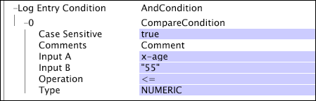
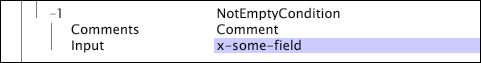
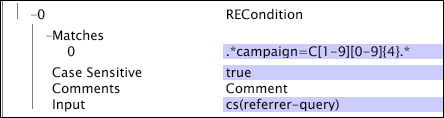
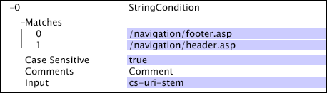

# Test Operation Conditions{#test-operation-conditions}

Information about test operation conditions including compare, not empty, range, regular expression, and string match.

* [Compare](../../../../home/c-dataset-const-proc/c-conditions/c-test-ops/c-test-op-con.md#section-fb2bdb3838504099b324b9838cdeeaac) 
* [Not Empty](../../../../home/c-dataset-const-proc/c-conditions/c-test-ops/c-test-op-con.md#section-1decb9d887894073a1b6b3d985729ac8) 
* [Range](../../../../home/c-dataset-const-proc/c-conditions/c-test-ops/c-test-op-con.md#section-1db31583bb09418b8f49481a897b08a6) 
* [Regular Expression](../../../../home/c-dataset-const-proc/c-conditions/c-test-ops/c-test-op-con.md#section-ae9c016502cb44128760c58f2d2d5297) 
* [String Match](../../../../home/c-dataset-const-proc/c-conditions/c-test-ops/c-test-op-con.md#section-f8d132085c6b4500bfbe4515b848142f)

## Compare {#section-fb2bdb3838504099b324b9838cdeeaac}

The [!DNL Compare] condition compares string or numeric values. For comparisons of string values, you can specify whether case should be considered.

The parameters of the [!DNL Compare] condition are described in the following table:

<table id="table_05B1FBB2AED242D99081E62BE2FBEC60"> 
 <thead> 
  <tr> 
   <th colname="col1" class="entry"> Parameter </th> 
   <th colname="col2" class="entry"> Description </th> 
   <th colname="col3" class="entry"> Default </th> 
  </tr> 
 </thead>
 <tbody> 
  <tr> 
   <td colname="col1"> Case Sensitive </td> 
   <td colname="col2">True or false. Used only if the Type is  LEXICAL. If set to false, upper and lower case letters are considered equal. </td> 
   <td colname="col3"> true </td> 
  </tr> 
  <tr> 
   <td colname="col1"> Comments </td> 
   <td colname="col2"> Optional. Notes about the condition. </td> 
   <td colname="col3"> Comments </td> 
  </tr> 
  <tr> 
   <td colname="col1"> Input A </td> 
   <td colname="col2"> The first of the two values to compare. This value represents the left operand in the condition. </td> 
   <td colname="col3"> </td> 
  </tr> 
  <tr> 
   <td colname="col1"> Input B </td> 
   <td colname="col2"> The second of the two values to compare. This value represents the right operand in the condition. </td> 
   <td colname="col3"> </td> 
  </tr> 
  <tr> 
   <td colname="col1"> Operation </td> 
   <td colname="col2"> 
The comparison operation. The available operations (and their meanings) are as follows: 
     <ul id="ul_74F3C298E9CC4FE89897BA0052A9EB9F"> 
      <li id="li_1605FA73474E404A84056D40E7082623"> = or == (Input A equals Input B) </li> 
      <li id="li_F694A262ED7A4787B2A68B877339620C"> &lt;&gt; or != (Input A is not equal to Input B) </li> 
      <li id="li_1A75437E23B64BEB92297E1C771092B0"> &lt; (Input A is less than Input B) </li> 
      <li id="li_B80ED6BE9DEA41FE84BC6BA3B7759276"> &lt;= (Input A is less than or equal to Input B) </li> 
      <li id="li_93148F34065F489E8E198DFB9F9F0E70"> &gt; (Input A is greater than Input B) </li> 
      <li id="li_8A98EE9AED2445429805169040BB253D"> &gt;= (Input A is greater than or equal to Input B) </li> 
     </ul> 
 </td> 
   <td colname="col3"> = </td> 
  </tr> 
  <tr> 
   <td colname="col1"> Type </td> 
   <td colname="col2">The type of comparison to be made. Available types are  LEXICAL,  NUMERIC, and  DATETIME. For descriptions of the types, see <a href="../../../../home/c-dataset-const-proc/c-conditions/c-test-ops/c-test-types.md#concept-a9fca97a2f03464cb0cbab8b5f809d0a"> Test Types for Test Operations</a>. </td> 
   <td colname="col3">  LEXICAL </td> 
  </tr> 
 </tbody> 
</table>

This example uses a [!DNL Compare] condition to define the [!DNL Log Entry Condition]. As the data workbench server reads each event data record, it compares the numeric values x-age and 55. If for a given log entry, x-age is less than or equal to 55, the log entry is included in the dataset construction process.

## Not Empty {#section-1decb9d887894073a1b6b3d985729ac8}

The [!DNL Not Empty] condition checks a field to see if it contains a value or is empty. The condition is satisfied for any log entry whose value for the [!DNL Input] field is not empty.

The parameters of the [!DNL Not Empty] condition are described in the following table:

|  Parameter  | Description  | Default  |
|---|---|---|
|  Comments  | Optional. Notes about the condition.  | Comments  |
|  Input  | The name of the field from the log entry to check for content.  |  |

This example takes as its input x-some-field and tests whether the field is not empty. The condition is satisfied if the field is populated.

## Range {#section-1db31583bb09418b8f49481a897b08a6}

The [!DNL Range] condition takes an input field and determines whether the value of that field falls, inclusively, within the given minimum (Min) and maximum (Max) parameter values.

The parameters of the [!DNL Range] condition are described in the following table:

<table id="table_1587D8D333804FC28024C0DFC2F2D4D3"> 
 <thead> 
  <tr> 
   <th colname="col1" class="entry"> Parameter </th> 
   <th colname="col2" class="entry"> Description </th> 
   <th colname="col3" class="entry"> Default </th> 
  </tr> 
 </thead>
 <tbody> 
  <tr> 
   <td colname="col1"> Case Sensitive </td> 
   <td colname="col2">True or false. Used only if the  Type is  LEXICAL. If set to false, upper and lower case letters are considered equal. </td> 
   <td colname="col3"> true </td> 
  </tr> 
  <tr> 
   <td colname="col1"> Comments </td> 
   <td colname="col2"> Optional. Notes about the condition. </td> 
   <td colname="col3"> Comments </td> 
  </tr> 
  <tr> 
   <td colname="col1"> Input </td> 
   <td colname="col2"> The name of the field from the log entry to use as input. </td> 
   <td colname="col3"> </td> 
  </tr> 
  <tr> 
   <td colname="col1"> Min </td> 
   <td colname="col2"> 
Lower bound of range. 
 
 This parameter's value must be a literal value or a string - not a field name. If you use a date for this field, you must specify a time zone. For a list of supported time zone abbreviations, see <a href="../../../../home/c-dataset-const-proc/c-time-zone.md#concept-9b540ec3e770490d94e9d5a985765477"> Time Zone Codes</a>. 
 </td> 
   <td colname="col3"> </td> 
  </tr> 
  <tr> 
   <td colname="col1"> Max </td> 
   <td colname="col2"> 
Upper bound of range. 
 
 
Note: This parameter's value must be a literal value or a string - not a field name. If you use a date for this field, you must specify a time zone. For a list of supported time zone abbreviations, see <a href="../../../../home/c-dataset-const-proc/c-time-zone.md#concept-9b540ec3e770490d94e9d5a985765477"> Time Zone Codes</a>. 
 
 </td> 
   <td colname="col3"> </td> 
  </tr> 
  <tr> 
   <td colname="col1"> Type </td> 
   <td colname="col2">The type of comparison to be made. Available types are  LEXICAL,  NUMERIC, and  DATETIME. For descriptions of the types, see <a href="../../../../home/c-dataset-const-proc/c-conditions/c-test-ops/c-test-types.md#concept-a9fca97a2f03464cb0cbab8b5f809d0a"> Test Types for Test Operations</a>. </td> 
   <td colname="col3"> </td> 
  </tr> 
 </tbody> 
</table>

This example uses a [!DNL Range] condition to define the [!DNL Log Entry Condition]. As the data workbench server reads each [!DNL event data] record, it compares the numeric values x-age and 55. If for a given log entry, x-age is at least 55, the log entry is included in the dataset construction process. This example performs the same function as the [!DNL Compare] condition example. See [Compare](../../../../home/c-dataset-const-proc/c-conditions/c-test-ops/c-test-op-con.md#section-fb2bdb3838504099b324b9838cdeeaac).

>[!NOTE]
>
>If the Min or Max parameter is left blank, the data workbench server substitutes the minimum or maximum integer values available. The minimum value is zero (0), and the maximum value is infinity.

## Regular Expression {#section-ae9c016502cb44128760c58f2d2d5297}

The [!DNL Regular Expression] condition test uses regular expressions pattern matching (see [Regular Expressions](../../../../home/c-dataset-const-proc/c-reg-exp.md#concept-070077baa419475094ef0469e92c5b9c)) to determine whether the value of the specified input field contains a string that matches one of the patterns specified in the Matches parameter.

If the input is a vector of strings, only the first value in the vector is used for the test. The [!DNL Regular Expression] condition performs full string comparisons. If you want to identify substrings, you must prepend and append ".&#42;" to the string.

The parameters of the [!DNL Regular Expression] condition are described in the following table:

<table id="table_0BF5F89F87C9493B8DABA97620074FAD"> 
 <thead> 
  <tr> 
   <th colname="col1" class="entry"> Parameter </th> 
   <th colname="col2" class="entry"> Description </th> 
   <th colname="col3" class="entry"> Default </th> 
  </tr> 
 </thead>
 <tbody> 
  <tr> 
   <td colname="col1"> Case Sensitive </td> 
   <td colname="col2"> True or false. If set to false, upper and lower case letters are considered equal. </td> 
   <td colname="col3"> true </td> 
  </tr> 
  <tr> 
   <td colname="col1"> Comments </td> 
   <td colname="col2"> Optional. Notes about the condition. </td> 
   <td colname="col3"> Comments </td> 
  </tr> 
  <tr> 
   <td colname="col1"> Input </td> 
   <td colname="col2"> The name of the field from the log entry to use as input. </td> 
   <td colname="col3"> </td> 
  </tr> 
  <tr> 
   <td colname="col1"> Matches </td> 
   <td colname="col2"> 
The regular expression pattern(s) to match against the value of the input field. 
 
 <b> To add a regular expression pattern</b> 
     <ol id="ol_6D6467FF74334DEA8E8625C3B155D11D"> 
      <li id="li_9E13A63558FF44749C2E49BD50B7F770">Right-click  Matches. </li> 
      <li id="li_195A2F3B6B9442F5B1DACDE0FC96CE5C">Click  Add new &gt;  Regular Expression. </li> 
      <li id="li_225E98F8EF39426A9483B86EA2CFE6DF">Enter the desired regular expression in the text box. </li> 
     </ol> 
 </td> 
   <td colname="col3"> </td> 
  </tr> 
 </tbody> 
</table>

This example illustrates the use of the [!DNL Regular Expression] condition to match a field of data collected from website traffic. The condition returns true only if the cs(referrer-query) field contains a string matching the regular expression `campaign=C[1-9][0-9]{4}`. This regular expression matches any string containing `campaign=C12345`. However, the pattern would not match the string `campaign=C0123&` because the first character after the `C` is not in the range `1-9`.

## String Match {#section-f8d132085c6b4500bfbe4515b848142f}

The [!DNL String Match] condition tests for string equality. It takes a specified field as input and tests the value of that field in each log entry against the strings specified in the operation's Matches parameter. If any one of these case-sensitive match strings is the same as the value in the provided input field, the operation returns true. In the event that the [!DNL StringCondition] contains no match strings, the condition returns false. If the input is a vector of strings, only the first value (string) in the vector is used for the test.

<table id="table_BD599BAA5DD54B278813B6C38AC8DE6B"> 
 <thead> 
  <tr> 
   <th colname="col1" class="entry"> Parameter </th> 
   <th colname="col2" class="entry"> Description </th> 
   <th colname="col3" class="entry"> Default </th> 
  </tr> 
 </thead>
 <tbody> 
  <tr> 
   <td colname="col1"> Case Sensitive </td> 
   <td colname="col2"> True or false. If set to false, upper and lower case letters are considered equal. </td> 
   <td colname="col3"> true </td> 
  </tr> 
  <tr> 
   <td colname="col1"> Comments </td> 
   <td colname="col2"> Optional. Notes about the condition. </td> 
   <td colname="col3"> Comments </td> 
  </tr> 
  <tr> 
   <td colname="col1"> Input </td> 
   <td colname="col2"> The name of the field from the log entry to use as input. </td> 
   <td colname="col3"> </td> 
  </tr> 
  <tr> 
   <td colname="col1"> Matches </td> 
   <td colname="col2"> 
The string(s) to match against the value of the input field. 
 
 <b>To add a string</b> 
     <ol id="ol_9E32218C771445D88357960475FAD6EB"> 
      <li id="li_A700747858D0470491783E9B3933DAFE">Right-click  Matches. </li> 
      <li id="li_9D1A2462EA404B0F84426176737CAFED">Click  Add new &gt;  String. </li> 
      <li id="li_E84D2439B59548E5B1803C64A295A18E">Enter the desired string in the text box. </li> 
     </ol> 
 </td> 
   <td colname="col3"> </td> 
  </tr> 
 </tbody> 
</table>

This example uses data collected from website traffic to illustrate the use of the [!DNL String Match] condition. The condition tests whether the input field (cs-uri-stem) matches either of the two strings specified in the Matches parameter, and it succeeds if the field cs-uri-stem is either the exact string [!DNL /navigation/footer.asp] or the exact string [!DNL /navigation/header.asp].

