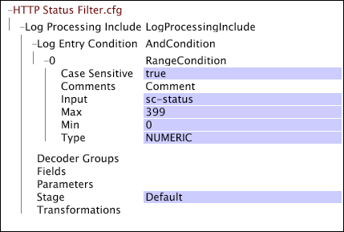
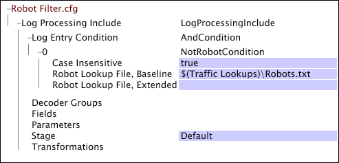

# Web-Specific Settings for Log Processing{#web-specific-settings-for-log-processing}

Information about web-specific settings that are defined in Log Processing Dataset Include files that are delivered with Adobe profiles for Site.

 The filtering defined by these settings occurs after the log entries leave the decoders and the transformations are applied but before evaluation by the [!DNL Log Entry Condition].

* [HTTP Status Filtering](../../../home/c-dataset-const-proc/c-config-web-data/c-web-spec-log-proc.md#section-ac66acdcb6aa467d81c3721199e540fd) 
* [Robot Filtering](../../../home/c-dataset-const-proc/c-config-web-data/c-web-spec-log-proc.md#section-7f43681dfbc64b969619cb88f97d5ad5)

## HTTP Status Filtering {#section-ac66acdcb6aa467d81c3721199e540fd}

You can configure your implementation of [!DNL Site] to remove log entries with sc-status codes of 400 or above from the dataset. Successful requests have status codes that are less than 400. Your default implementation includes a [!DNL Log Processing Dataset Include] file in which HTTP status filtering is configured.

**To edit the configuration settings for HTTP status filtering**

1. Open the [!DNL Profile Manager] within your dataset profile and open the [!DNL Dataset\Log Processing\Traffic\HTTP Status Filter.cfg] file.

   >[!NOTE]
   >
   >If you have customized your implementation of [!DNL Site], the file in which these configuration settings exist may differ from the location described.

1. Review or edit the values of the parameters of the file as desired. Use the following example as a guide.

   

   For information about the [!DNL Range] condition, see [Conditions](../../../home/c-dataset-const-proc/c-conditions/c-conditions.md#concept-9a576a00d5db48e7a599016c441e39e0). 

1. Save the [!DNL HTTP Status Filter.cfg] file by right-clicking **[!UICONTROL (modified)]** at the top of the window and clicking **[!UICONTROL Save]**. 

1. To make the locally made changes take effect, in the [!DNL Profile Manager], right-click the check mark for the file in the [!DNL User] column, then click **[!UICONTROL Save to]** > *< **[!UICONTROL profile name]**>*, where profile name is the name of the dataset profile or the inherited profile to which the dataset include file belongs.

   >[!NOTE]
   >
   >Do not save the modified configuration file to any of the internal profiles provided by Adobe, as your changes are overwritten when you install updates to these profiles.

## Robot Filtering {#section-7f43681dfbc64b969619cb88f97d5ad5}

You can configure your implementation of [!DNL Site] to use lookup files to remove log entries generated by known robots, test scripts, and IP addresses for internal users from your dataset. Your default implementation includes a [!DNL Log Processing Dataset Include] file in which robot filtering is configured.

**To edit the configuration settings for robot filtering**

1. Open the [!DNL Profile Manager] within your dataset profile and open the [!DNL Dataset\Log Processing\Traffic\Robot Filter.cfg] file.

   >[!NOTE]
   >
   >If you have customized your implementation of [!DNL Site], the file in which these configuration settings exist may differ from the location described.

1. Review or edit the parameters of the file using the following example and information as guides:

   

   The file includes a [!DNL NotRobotCondition] that is defined by the following three parameters:

    * **Case Insensitive Robot Filtering:** True or false. If true, letter case (upper/lower) is not considered in robot filtering. 
    * **Robot Lookup File, Baseline:** The path and filename of the text file that contains a list of browser user agents that are known robots and are to be filtered out of the dataset. Adobe provides the baseline robot lookup file. If you do not specify a path, the data workbench server looks for this file in the Lookups directory within the data workbench server installation directory. 
    * **Robot Lookup File, Extended:** The path and filename of an optional text file that contains a list of browser user agents or IP addresses that define robots specific to your implementation. This list can include internal monitoring robots, test scripts, and IP addresses for internal users that should be filtered out of the dataset. If you do not specify a path, the data workbench server looks for this file in the Lookups directory within the data workbench server installation directory.

   If a log entry's browser user agent is not listed in either lookup file, the log entry is considered to be generated by a real visitor and is not filtered from the dataset.

   >[!NOTE]
   >
   >Matching in the robot lookup files uses substrings to compare against the c-ip and the cs(user-agent) log fields. If the search string starts with "$" it must match the front of the string being tested, and if it ends with "$" the search string must match the end of the string being tested. If the search string both begins with and ends with "$" the strings must match exactly for the log entry to be filtered out. For example, to test for all IP addresses in a class C block, you would use a string such as $231.78.123. to force a match at the front of the string. This would match addresses 231.78.123.0 through 231.78.123.255.

1. Save the file by right-clicking **[!UICONTROL (modified)]** at the top of the window and clicking **[!UICONTROL Save]**. 

1. To make the locally made changes take effect, in the [!DNL Profile Manager], right-click the check mark for the file in the [!DNL User] column, then click **[!UICONTROL Save to]** > *< **[!UICONTROL profile name]**>*, where profile name is the name of the dataset profile or the inherited profile to which the dataset include file belongs.

   Do not save the modified configuration file to any of the internal profiles provided by Adobe, as your changes are overwritten when you install updates to these profiles.

   >[!NOTE]
   >
   >If it is critical that the underlying log entries used to construct a dataset do not change (even if the transformations used to construct and update the dataset and its dimensions change), the Robot Lookup File, Baseline, and the Robot Lookup File, Extended, should be version controlled. Placing a version number on these files ensures that updates to the default robot lookup files do not unintentionally change previously constructed reporting datasets by adding or deleting entries in these files.

