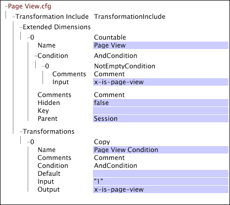
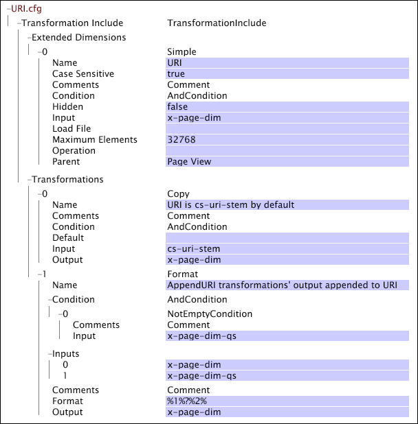
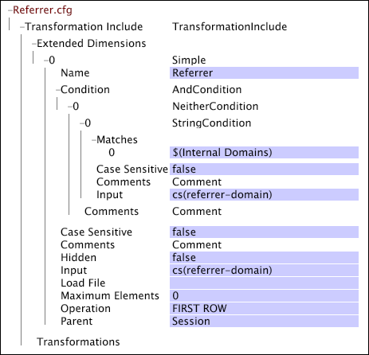
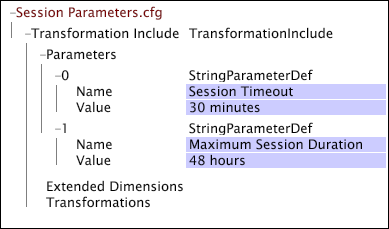
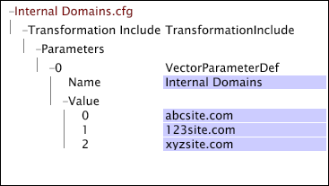

# Web-Specific Settings for Transformation{#web-specific-settings-for-transformation}

Information about web-specific settings that are defined in Transformation Dataset Include files that are delivered with Adobe profiles for Site.

 The conditions, dimensions, and parameters that are defined by these settings are created during the transformation phase of dataset construction.

* [Page View Condition](../../../home/c-dataset-const-proc/c-config-web-data/c-web-spec-transf.md#section-cc2807a12a88492f8b64a43234a1f835) 
* [URI Dimension](../../../home/c-dataset-const-proc/c-config-web-data/c-web-spec-transf.md#section-348f7e9099d049d197a7cdcbc8a6c234) 
* [Referrer Dimension](../../../home/c-dataset-const-proc/c-config-web-data/c-web-spec-transf.md#section-8a97ec34d18b4814b5f95495ac4f8638) 
* [Session Parameters](../../../home/c-dataset-const-proc/c-config-web-data/c-web-spec-transf.md#section-0a209b0c504041a5801f7f71a963c8b1)

## Page View Condition {#section-cc2807a12a88492f8b64a43234a1f835}

The [!DNL Page View Condition] is a condition operation that determines whether a particular log entry (that is, a page request) should be included in the data gathered about a visitor's page view history. When the log entry satisfies the [!DNL Page View Condition], it becomes an element of the Page View countable dimension. If a log entry does not satisfy the [!DNL Page View Condition], its data fields still are accessible by other dimensions. In addition to the Page View dimension, the following dimensions can be affected by the results of the [!DNL Page View Condition]:

* **[!DNL URI] and [!DNL Page]:** These dimensions are directly affected by the [!DNL Page View Condition]. If the given page does not pass the [!DNL Page View Condition,] it is not be included in the URI or Page dimensions. 

* **[!DNL Visitor Page Views] and [!DNL Session Page Views]:** The Visitor Page Views and Session Page Views dimensions are a count of the number of pages viewed by a visitor to or in a given session, respectively. Pages filtered out by the [!DNL Page View Condition] are not part of this count. 

* **Session Number:** The [!DNL Page View Condition] has an indirect effect on the Session Number dimension. The Session Number dimension is created prior to the [!DNL Page View Condition]; therefore, when considering [!DNL Session Number] in relation to the [!DNL Page Views], it is possible to have sessions with no page views.

Your default implementation of [!DNL Site] includes a [!DNL Transformation Dataset Include] file in which the Page View countable dimension and the related [!DNL Page View Condition] are defined.

For information about countable dimensions, see [Extended Dimensions](../../../home/c-dataset-const-proc/c-ex-dim/c-ex-dim.md#concept-79b9e2b3f5794833b8b73b003f06ddca).

**To edit the configuration settings for the Page View Condition**

1. Open the [!DNL Profile Manager] within your dataset profile and open the [!DNL Dataset\Transformation\Traffic\Page View.cfg] file.

   >[!NOTE]
   >
   >If you have customized your implementation of [!DNL Site], the file in which these configuration settings exist may differ from the location described.

1. Review or edit the values of the parameters of the [!DNL Page View Condition] as needed. Use the following example as a guide. In this file, the [!DNL Page View Condition] is defined by a [!DNL Copy] transformation. Note that this file also contains the definition of the Page View countable dimension.

   

   >[!NOTE]
   >
   >For information about countable dimensions, see [Extended Dimensions](../../../home/c-dataset-const-proc/c-ex-dim/c-ex-dim.md#concept-79b9e2b3f5794833b8b73b003f06ddca). For information about the [!DNL Copy] transformation, see [Data Transformations](../../../home/c-dataset-const-proc/c-data-trans/c-data-trans.md#concept-99c6f5e6e5194adb9e98afdc0e91cf38).

1. Save the file by right-clicking **[!UICONTROL (modified)]** at the top of the window, then click **[!UICONTROL Save]**. 

1. To make the locally made changes take effect, in the [!DNL Profile Manager], right-click the check mark for the file in the [!DNL User] column, then click **[!UICONTROL Save to]** > *< **[!UICONTROL profile name]**>*, where profile name is the name of the dataset profile or the inherited profile to which the dataset include file belongs.

   >[!NOTE]
   >
   >Do not save the modified configuration file to any of the internal profiles provided by Adobe, as your changes are overwritten when you install updates to these profiles.

## URI Dimension {#section-348f7e9099d049d197a7cdcbc8a6c234}

If you are working with [!DNL Site], you need to define the URI dimension whose elements are the URI stems of the website pages viewed. Your default implementation includes a [!DNL Transformation Dataset Include] file in which the URI simple dimension is defined.

For information about simple dimensions, see [Extended Dimensions](../../../home/c-dataset-const-proc/c-ex-dim/c-ex-dim.md#concept-79b9e2b3f5794833b8b73b003f06ddca).

**To edit the configuration settings for the URI dimension**

1. Open the [!DNL Profile Manager] within your dataset profile and open the [!DNL Dataset\Transformation\Traffic\URI.cfg] file.

   >[!NOTE]
   >
   >If you have customized your implementation of [!DNL Site], the file in which these configuration settings exist may differ from the location described.

1. Review or edit the values of the parameters of the file as desired. Use the following example and information as guides.

The configuration settings for the URI dimension include the following two parameters:

* **Case Sensitive:** True or false. If true, letter case (upper/lower) is considered in identifying unique pages. The default value is true. 
* **Maximum Elements:** The maximum number of elements (that is, URIs) for the URI dimension. The default value is 32768.

  >[!NOTE]
  >
  >Changing this value can cause serious performance issues. Do not change this value without consulting Adobe.

* Save the [!DNL URI.cfg] file by right-clicking **[!UICONTROL (modified)]** at the top of the window, then click **[!UICONTROL Save]**. 

* To make the locally made changes take effect, in the [!DNL Profile Manager], right-click the check mark for the file in the [!DNL User] column, then click **[!UICONTROL Save to]** > *< **[!UICONTROL profile name]**>*, where profile name is the name of the dataset profile or the inherited profile to which the dataset include file belongs.

  >[!NOTE]
  >
  >Do not save the modified configuration file to any of the internal profiles provided by Adobe, as your changes are overwritten when you install updates to these profiles.

## Referrer Dimension {#section-8a97ec34d18b4814b5f95495ac4f8638}

If you are working with [!DNL Site], you need to define the Referrer dimension whose elements consist of the second level domains of the referrers of the first log entries in all sessions. Your default implementation includes a [!DNL Transformation Dataset Include] file in which the Referrer simple dimension is defined.

For information about simple dimensions, see [Extended Dimensions](../../../home/c-dataset-const-proc/c-ex-dim/c-ex-dim.md#concept-79b9e2b3f5794833b8b73b003f06ddca).

**To edit the configuration settings for the Referrer dimension**

1. Open the [!DNL Profile Manager] within your dataset profile and open the [!DNL Dataset\Transformation\Traffic\Referrer.cfg] file.

   >[!NOTE]
   >
   >If you have customized your implementation of [!DNL Site], the file in which these configuration settings exist may differ from the location described.

1. Review or edit the values of the parameters of the file as desired. Use the following example and information as guides.

   

   The configuration settings for the Referrer dimension include the Maximum Elements parameter, which specifies the maximum number of elements (that is, referrers) for the Referrer dimension. The default value is 32768.

   >[!NOTE]
   >
   >In the example above, the [!DNL Maximum Elements] parameter is set to 0. When this parameter is set to 0, the data workbench server uses its internal default value of 32768.

1. Save the [!DNL Referrer.cfg] file by right-clicking **[!UICONTROL (modified)]** at the top of the window, then click **[!UICONTROL Save]**. 

1. To make the locally made changes take effect, in the [!DNL Profile Manager], right-click the check mark for the file in the [!DNL User] column, then click **[!UICONTROL Save to]** > *< **[!UICONTROL profile name]**>*, where profile name is the name of the dataset profile or the inherited profile to which the dataset include file belongs.

   >[!NOTE]
   >
   >Do not save the modified configuration file to any of the internal profiles provided by Adobe, as your changes are overwritten when you install updates to these profiles.

## Session Parameters {#section-0a209b0c504041a5801f7f71a963c8b1}

If you are working with [!DNL Site], you can specify parameters that define the boundaries of a visitor's session on a website. These parameters are valid only when defined in a [!DNL Transformation Dataset Include] file within your [!DNL Site] implementation.

The following parameters are unique in that they can be members of [!DNL Transformation Dataset Include] file's [!DNL Parameters] vector, or they can be listed as individual parameters in the [!DNL Transformation.cfg]file. A parameter can be defined exactly once, so these parameters are defined either in the [!DNL Transformation.cfg]file or in the [!DNL Parameters] vector of the dataset include file - not in both files. 
**Maximum Session Duration and Session Timeout**

Maximum Session Duration and Session Timeout are string parameters that define the length of a visitor's session. These parameters work with the Internal Domains parameter to determine session length.

Maximum Session Duration specifies the longest length of session before a new session is started. This keeps web pages that have auto content refreshing from creating sessions that are arbitrarily long. If the referrer of a click is set to one of the entries in the Internal Domains parameter, this timeout is used to define the end of a session. No session may be longer than the specified Maximum Session Duration regardless of how many clicks it contains. The recommended value is 48 hours.

Session Timeout specifies the amount of time that needs to pass between log entries of a given visitor to determine the end of one session and the start of a new session (that is, the typical timeout used to define a user session). The recommended value of this parameter is 30 minutes. If the referrer of a click is not set to one of the referrers in the Internal Domains parameter, this timeout is used to define the session. If cs(referrer-domain) for a log entry is in the list of internal domains, then Maximum Session Duration determines whether the current log entry is part of an existing session or the start of a new session.

Consider a situation in which a visitor is called away from his computer for a period of time longer than the Session Timeout while in the middle of browsing the site. Upon returning, he continues browsing where he left off. Because the visitor never leaves the site or closes his browser, the cs(referrer-domain) of his next click is the same as the internal domain, and his original session remains active as long as the Maximum Session Duration setting is not reached. If the domain of the site is listed as an internal domain, and the maximum timeout is not reached, the visitor's interaction appears as a single session and not two separate sessions. However, if the visitor returns to his computer and his next click has an external (or blank) referrer, a new session begins.

>[!NOTE]
>
>The [!DNL Sessionize] transformation's [!DNL Timeout Condition] also plays a role in determining the length of a visitor's session. If Session Timeout and Maximum Session Duration do not apply, the [!DNL Timeout Condition] is checked to determine whether a log entry should be considered the start of a new session. For more information, see [Data Transformations](../../../home/c-dataset-const-proc/c-data-trans/c-data-trans.md#concept-99c6f5e6e5194adb9e98afdc0e91cf38).

**To edit the Maximum Session Duration and Session Timeout parameters**

If you are working with [!DNL Site], your default implementation likely includes a [!DNL Transformation Dataset Include] file in which the names and recommended values of these parameters are specified.

1. Open the [!DNL Profile Manager] within your dataset profile and go to [!DNL Dataset\Transformation\Traffic\Session Parameters.cfg].

   >[!NOTE]
   >
   >If you have customized your implementation of [!DNL Site], the file in which these parameters are defined may differ from the location described.

1. Edit the values of the parameters as desired. Be sure to specify the desired units (minutes, hours, and so on).

   

1. Save the [!DNL Session Parameters.cfg] file by right-clicking **[!UICONTROL (modified)]** at the top of the window and clicking **[!UICONTROL Save]**. 

1. To make the locally made changes take effect, in the [!DNL Profile Manager], right-click the check mark for the file in the [!DNL User] column, then click **[!UICONTROL Save to]** >  **[!UICONTROL profile name]**, where profile name is the name of the dataset profile or the inherited profile to which the dataset include file belongs.

   >[!NOTE]
   >
   >Do not save the modified configuration file to any of the internal profiles provided by Adobe, as your changes are overwritten when you install updates to these profiles.

**[!DNL Internal Domains]**

[!DNL Internal Domains] is a vector parameter that lists domain level hosts (internal referrers) that should be treated as part of a particular website. These hosts are removed from the referrer dimension (which is a list of the external referrer information). When cs(referrer-domain) matches any of the strings listed in the set of internal domains, Session Timeout is ignored and Maximum Session Duration is used to determine session length.

The Internal Domains parameter also can be used to prevent the start of a new session when visitors move among a company's multiple domains associated in a way that exceeds session timeout. For example, consider a company that has parts of its site split across two domains: one is logged ( [!DNL xyz.com]), and the other is not logged ( [!DNL xyz-unlogged.com]). If these sites are integrated in a way that facilitates the seamless movement of traffic across the two domains, it is not desirable to generate a different session each time the visitor moves from [!DNL xyz-unlogged.com] domain back to the [!DNL xyz.com] domain. Listing [!DNL xyz-unlogged.com] as an internal domain keeps sessions from being split into multiple sessions as a result of traffic across these two domains as long as the Maximum Session Duration setting is not reached.

**To add an internal domain**

If you are working with [!DNL Site], your default implementation includes a [!DNL Transformation Dataset Include] file for defining the Internal Domains parameter. In this file, the parameter is named; you just enter the internal domains that you want to include and save the updated file.

1. Open the [!DNL Profile Manager] within your dataset profile and go to [!DNL Dataset\Transformation\Traffic\Internal Domains.cfg.] 

   >[!NOTE]
   >
   >If you have customized your implementation of [!DNL Site], the file in which the Internal Domains parameter is defined may differ from the location described.

1. Right-click **[!UICONTROL Value]** for the Internal Domains vector parameter and click **[!UICONTROL Add new]** > **[!UICONTROL Value]**. 

1. Edit the values as desired.

   

1. Save the [!DNL Internal Domains.cfg] file by right-clicking **[!UICONTROL (modified)]** at the top of the window and clicking **[!UICONTROL Save]**. 

1. To make the locally made changes take effect, in the [!DNL Profile Manager], right-click the check mark for the file in the [!DNL User] column, then click **[!UICONTROL Save to]** > *< **[!UICONTROL profile name]**>*, where profile name is the name of the dataset profile or the inherited profile to which the dataset include file belongs.

   >[!NOTE]
   >
   >Do not save the modified configuration file to any of the internal profiles provided by Adobe, as your changes are overwritten when you install updates to these profiles.

