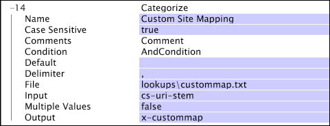
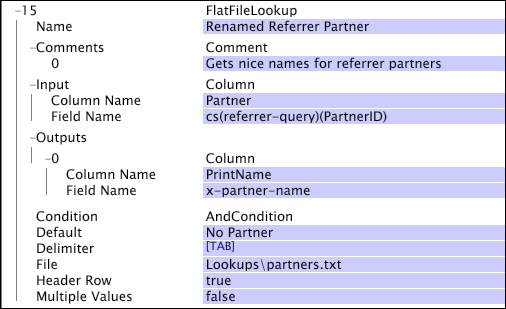
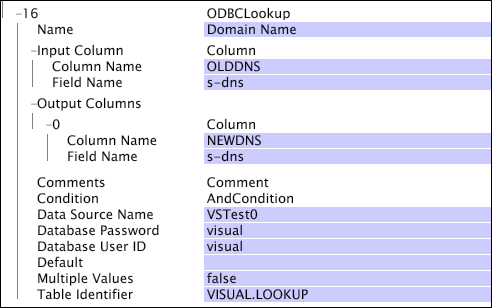

# Defining Lookup Transformations{#defining-lookup-transformations}

Information about the transformations that you can use to incorporate lookup data into the dataset.

 Note that not all types can be used during both phases of the dataset construction process.

* [Categorize](../../../../home/c-dataset-const-proc/c-data-trans/c-int-lookup-data/c-def-lookup-transf.md#section-8474376c14e54d14ae73749696ada468) 
* [FlatFileLookup](../../../../home/c-dataset-const-proc/c-data-trans/c-int-lookup-data/c-def-lookup-transf.md#section-e09b2eeb96444a859b14f03cdaab31f2) 
* [ODBCLookup](../../../../home/c-dataset-const-proc/c-data-trans/c-int-lookup-data/c-def-lookup-transf.md#section-4dcc3747e42e45c0a057e85f308a83cc)

## Categorize {#section-8474376c14e54d14ae73749696ada468}

The [!DNL Categorize] transformation uses a two-column lookup table composed of pattern-string/value pairs. During this transformation, the data workbench server reads each event data record in turn and compares the contents of a designated field in the record to each of the pattern strings listed in the first column of the lookup table. If the designated field matches one of the pattern strings, the data workbench server writes the value (found in the second column) that is associated with that pattern string to a designated output field in the record.

The strings in the first column of the lookup table optionally can start with the ^ character and/or end in the $ character to force matching at the beginning and/or end. This transformation does not accept regular expressions for defining match conditions in the first column. If the input value is a vector of strings, each string is run through the transformation and the result(s) are appended to an output string vector.

A [!DNL Categorize] transformation is generally easier and faster than using a [!DNL Regular Expression] transformation to accomplish the same thing.

>[!NOTE]
>
>The substring test used in [!DNL Categorize] is case-sensitive unless otherwise specified using the [!DNL Case Sensitive] parameter.

<table id="table_1773344FAAE34BD4919CC4414249FDEE"> 
 <desc> 
  <b>  Categorize </b> 
 </desc> 
 <thead> 
  <tr valign="top"> 
   <th colname="col1" class="entry"> Parameter </th> 
   <th colname="col2" class="entry"> Description </th> 
   <th colname="col3" class="entry"> Default </th> 
  </tr> 
 </thead>
 <tbody> 
  <tr valign="top"> 
   <td colname="col1"> Name </td> 
   <td colname="col2"> Descriptive name of the transformation. You can enter any name here. </td> 
   <td colname="col3"> </td> 
  </tr> 
  <tr valign="top"> 
   <td colname="col1"> Case Sensitive </td> 
   <td colname="col2"> True or false. Specifies whether the substring test is case-sensitive. </td> 
   <td colname="col3"> true </td> 
  </tr> 
  <tr valign="top"> 
   <td colname="col1"> Comments </td> 
   <td colname="col2"> Optional. Notes about the transformation. </td> 
   <td colname="col3"> </td> 
  </tr> 
  <tr valign="top"> 
   <td colname="col1"> Condition </td> 
   <td colname="col2"> The conditions under which this transformation is applied. </td> 
   <td colname="col3"> </td> 
  </tr> 
  <tr valign="top"> 
   <td colname="col1"> Default </td> 
   <td colname="col2"> The default value to use if the condition test passes and no entry in the categorization file matches the input, or the input field is not defined in the given log entry. </td> 
   <td colname="col3"> </td> 
  </tr> 
  <tr valign="top"> 
   <td colname="col1"> Delimiter </td> 
   <td colname="col2"> 
String that is used to separate the columns in the lookup file. Must be a single character in length. 
 
 If you hold down the Ctrl key and right-click within the Delimiter parameter, an  Insert menu appears. This menu contains a list of special characters that often are used as delimiters. 
 </td> 
   <td colname="col3"> </td> 
  </tr> 
  <tr valign="top"> 
   <td colname="col1"> Multiple Values </td> 
   <td colname="col2"> True or false. If true, when multiple rows in the file match the input, each match results in a value being appended to the output vector of strings. If false, only the first matching row in the file is used in the output. In the latter case, if the input is a vector, the output is also a vector of equivalent length. If the input is a simple string, the output is also a simple string. </td> 
   <td colname="col3"> false </td> 
  </tr> 
  <tr valign="top"> 
   <td colname="col1"> File </td> 
   <td colname="col2"> Path and file name of the categorization file. Relative paths are with respect to the installation directory for the data workbench server. This file is typically located in the Lookups directory within the data workbench server installation directory. </td> 
   <td colname="col3"> </td> 
  </tr> 
  <tr valign="top"> 
   <td colname="col1"> Input </td> 
   <td colname="col2"> The categorization file matches its substrings against the value in this field to identify the matching row in the file. </td> 
   <td colname="col3"> </td> 
  </tr> 
  <tr valign="top"> 
   <td colname="col1"> Output </td> 
   <td colname="col2"> The name of the field associated with the result. </td> 
   <td colname="col3"> </td> 
  </tr> 
 </tbody> 
</table>

>[!NOTE]
>
>**Considerations for Categorize**

* Changes to lookup files in [!DNL Categorize] transformations defined in the [!DNL Transformation.cfg] file or in a [!DNL Transformation Dataset Include] file require retransformation of the dataset. Lookup files for [!DNL Categorize] transformations defined in the [!DNL Log Processing.cfg] file or a [!DNL Log Processing Dataset Include] file are not subject to this limitation. For information about reprocessing your data, see [Reprocessing and Retransformation](../../../../home/c-dataset-const-proc/c-reproc-retrans/c-reproc-retrans.md#concept-6d82a173e4ab4111b673e7c2477d0823). 

* [!DNL Categorize] transformations defined in the [!DNL Log Processing.cfg] file or a [!DNL Log Processing Dataset Include] file reload their lookup files whenever the lookup files change. Changes are not applied retroactively, but they apply to all log data read after the change takes place.

This example illustrates the use of the [!DNL Categorize] transformation to integrate lookup data with event data collected from website traffic. Suppose that a particular website has business sections, and there is a requirement to be able to look at and make comparisons based on traffic flow and value generated by the different sections. You can create a lookup file that lists the substrings used to identify these different sections.

The lookup file [!DNL Lookups\custommap.txt] contains the following table: 

|  /products/  | Products  |
|---|---|
|  ^/sports/  | Sports  |
|  ^/news/  | News  |
|  ...  | ...  |

This categorization file maps anything containing the string "/products/" to the value "Products," anything starting with "/sports/" to the value "Sports," and anything starting with "/news/" to the value "News." The following categorization transformation uses the value in the cs-uri-stem field as the string within which we are looking for a matching substring. The result of the transformation is placed into the x-custommap field.

Assuming that the Multiple Values parameter is set to false, the example would produce the following values for x-custommap given the listed values for cs-uri-stem. 

|  [!DNL cs-uri-stem]  | [!DNL x-custommap]  |
|---|---|
|  [!DNL /sports/news/today.php]  | Sports  |
|  [!DNL /sports/products/buy.php]  | Products  |
|  [!DNL /news/headlines.php]  | News  |
|  [!DNL /news/products/subscribe.php]  | Products  |

The output is based on the order of the substrings in the lookup file. For example, the cs-uri-stem [!DNL /sports/products/buy.php] returns "Products." Although the URI stem starts with "/sports/," the string "/products/" is listed before "/sports/" in the lookup file. If the Multiple Values parameter were set to true, there would be an additional value for x-custommap, as the last example would match two rows in the lookup table: Products and News.

## FlatFileLookup {#section-e09b2eeb96444a859b14f03cdaab31f2}

The [!DNL FlatFileLookup] transformation uses a lookup table composed of any number of columns and rows (although, recall that it resides in memory). During this type of transformation, the data workbench server reads each event data record in turn and compares the contents of a designated field in the record to each of the values in a designated column of the lookup table. If there is a match, the data workbench server writes one or more values from the matching row in the lookup table to one or more designated output fields in the event data record.

The lookup table used during this transformation is populated from a flat file whose location you specify when you define the transformation. 

<table id="table_772B8ABF3B44493F99069010DDB5F77A"> 
 <desc> 
  <b>  FlatFileLookup </b> 
 </desc> 
 <thead> 
  <tr valign="top"> 
   <th colname="col1" class="entry"> Parameter </th> 
   <th colname="col2" class="entry"> Description </th> 
   <th colname="col3" class="entry"> Default </th> 
  </tr> 
 </thead>
 <tbody> 
  <tr valign="top"> 
   <td colname="col1"> Name </td> 
   <td colname="col2"> Descriptive name of the transformation. You can enter any name here. </td> 
   <td colname="col3"> </td> 
  </tr> 
  <tr valign="top"> 
   <td colname="col1"> Comments </td> 
   <td colname="col2"> Optional. Notes about the transformation. </td> 
   <td colname="col3"> </td> 
  </tr> 
  <tr valign="top"> 
   <td colname="col1"> Condition </td> 
   <td colname="col2"> The conditions under which this transformation is applied. </td> 
   <td colname="col3"> </td> 
  </tr> 
  <tr valign="top"> 
   <td colname="col1"> Default </td> 
   <td colname="col2"> The default value to use if the condition is met and if no entry in the lookup file matches the input. </td> 
   <td colname="col3"> </td> 
  </tr> 
  <tr valign="top"> 
   <td colname="col1"> Delimiter </td> 
   <td colname="col2"> 
String that is used to separate the columns in the lookup file. Must be a single character in length. 
 
 If you hold down the Ctrl key and right-click within the Delimiter parameter, an  Insert menu appears. This menu contains a list of special characters that often are used as delimiters. 
 </td> 
   <td colname="col3"> </td> 
  </tr> 
  <tr valign="top"> 
   <td colname="col1"> File </td> 
   <td colname="col2"> Path and file name of the lookup file. Relative paths are with respect to the installation directory for the data workbench server. This file is typically located in the Lookups directory within the data workbench Server installation directory. </td> 
   <td colname="col3"> </td> 
  </tr> 
  <tr valign="top"> 
   <td colname="col1"> Header Row </td> 
   <td colname="col2"> True or false. Indicates that the first row in the table is a header row to be ignored in processing. </td> 
   <td colname="col3"> </td> 
  </tr> 
  <tr valign="top"> 
   <td colname="col1"> Input </td> 
   <td colname="col2">  Column Name is the name of the column used for matching the input to the row(s) in the file. If Header Row is true, this can be the name of a column in the lookup file. Otherwise, this must be the zero-based column number to match against.  Field Name is the name of the field used to locate the row in the lookup file. </td> 
   <td colname="col3"> </td> 
  </tr> 
  <tr valign="top"> 
   <td colname="col1"> Multiple Values </td> 
   <td colname="col2"> 
True or false. Determines whether a single value (a matching row) or multiple values should be returned (one for each matching row). 
 
 
Note:  If  Multiple Values is set to false, you must ensure that there are not multiple matches. When multiple matches occur, there is no guarantee which match will be returned. 
 
 </td> 
   <td colname="col3"> </td> 
  </tr> 
  <tr valign="top"> 
   <td colname="col1"> Outputs </td> 
   <td colname="col2"> 
A vector of column objects (results) in which each object is defined by column and field names. 
 
  Column Name is the column from which the output value is obtained. If  Header Row is true, this can be the name of a column in the lookup file. Otherwise, this must be the zero-based column number to match against. 
 
  Field Name is the name of the field used to capture the output. Note that this can be a vector of results, one for each row identified in the case where the Multiple Values parameter is true. 
 </td> 
   <td colname="col3"> </td> 
  </tr> 
 </tbody> 
</table>

>[!NOTE]
>
>**Considerations for [!DNL FlatFileLookup]**

* Matching the input field to the lookup file is always case-sensitive. 
* Changes to lookup files in [!DNL FlatFileLookup] transformations defined in the [!DNL Transformation.cfg] file or [!DNL Transformation Dataset Include] files require retransformation of the dataset. Lookup files for [!DNL FlatFileLookup] transformations defined in the [!DNL Log Processing.cfg] file or [!DNL Log Processing Dataset Include] files are not subject to this limitation. For information about reprocessing your data, see [Reprocessing and Retransformation](../../../../home/c-dataset-const-proc/c-reproc-retrans/c-reproc-retrans.md#concept-6d82a173e4ab4111b673e7c2477d0823). 

* [!DNL FlatFileLookup] transformations in the [!DNL Log Processing.cfg] file or [!DNL Log Processing Dataset Include] files reload their lookup files whenever the lookup files change. Changes are not applied retroactively, but they apply to all log data read after the change takes place.

This example illustrates the use of the [!DNL FlatFileLookup] transformation to integrate lookup data with event data collected from website traffic. Suppose that you want to isolate website partners that are routing traffic to the website and transform their partner IDs into more user-friendly names. You then can use the user-friendly names to create extended dimensions and visualizations that map more clearly to the business relationship than the site-to-site relationship used for routing traffic.

The example transformation searches the cs(referrer-query) field for the PartnerID name-value pair, and, if located, the lookup file [!DNL Lookups\partners.txt] is used to compare the PartnerID value against the values in the [!DNL Partner] column of the table. If a row is located, the output field x-partner-name is given the name from the [!DNL PrintName] column of the identified row.

If the lookup table contained the following information: 

|  ID  | Partner  | Started  | PrintName  |
|---|---|---|---|
|  1  | P154  | Aug 21, 1999  | Yahoo  |
|  2  | P232  | July 10, 2000  | Microsoft  |
|  3  | P945  | Jan 12, 2001  | Amazon  |

The following examples would transform as follows:

* If cs(referrer)(PartnerID) returned P232, the field x-partner-name would be given the value "Microsoft." 
* If cs(referrer)(PartnerID) returned P100, the field x-partner-name would be given the value "No Partner." 
* If cs(referrer)(PartnerID) returned nothing, the field x-partner-name would be given the value "No Partner" as specified by the Default parameter.

## ODBCLookup {#section-4dcc3747e42e45c0a057e85f308a83cc}

The [!DNL ODBCLookup] transformation operates like a [!DNL FlatFileLookup] transformation. The only difference is that the lookup table used during this transformation is populated from an ODBC database and not a flat file.

>[!NOTE]
>
>[!DNL ODBCLookup] transformations can be executed only during the transformation phase of the dataset construction process. When possible, Adobe recommends that you use the [!DNL FlatFileLookup] transformation instead of the [!DNL ODBCLookup] transformation. [!DNL FlatFileLookup] transformations are inherently more reliable because they do not depend on the availability of an outside system. Additionally, there is less risk that the lookup table is modified if it resides in a flat file that you control locally.

<table id="table_B903DB291BCC4F44B09D54300216D288"> 
 <desc> 
  <b>  ODBCLookup </b> 
 </desc> 
 <thead> 
  <tr valign="top"> 
   <th colname="col1" class="entry"> Parameter </th> 
   <th colname="col2" class="entry"> Description </th> 
   <th colname="col3" class="entry"> Default </th> 
  </tr> 
 </thead>
 <tbody> 
  <tr valign="top"> 
   <td colname="col1"> Name </td> 
   <td colname="col2"> Descriptive name of the transformation. You can enter any name here. </td> 
   <td colname="col3"> </td> 
  </tr> 
  <tr valign="top"> 
   <td colname="col1"> Comments </td> 
   <td colname="col2"> Optional. Notes about the transformation. </td> 
   <td colname="col3"> </td> 
  </tr> 
  <tr valign="top"> 
   <td colname="col1"> Condition </td> 
   <td colname="col2"> The conditions under which this transformation is applied. </td> 
   <td colname="col3"> </td> 
  </tr> 
  <tr valign="top"> 
   <td colname="col1"> Data Source Name </td> 
   <td colname="col2"> A DSN, as provided by an administrator of the data workbench server machine on which the dataset is processed, that refers to the database from which data is to be loaded. </td> 
   <td colname="col3"> </td> 
  </tr> 
  <tr valign="top"> 
   <td colname="col1"> Database Password </td> 
   <td colname="col2">The password to be used when connecting to the database. If a password has been configured for the DSN in the  Data Source Administrator, this may be left blank. Any password supplied here overrides the password configured for the DSN in the  Data Source Administrator. </td> 
   <td colname="col3"> </td> 
  </tr> 
  <tr valign="top"> 
   <td colname="col1"> Database User ID </td> 
   <td colname="col2">The user ID to be used when connecting to the database. If a user ID has been configured for the DSN in the  Data Source Administrator, this may be left blank. Any user ID supplied here overrides the user ID configured for the DSN in the  Data Source Administrator. </td> 
   <td colname="col3"> </td> 
  </tr> 
  <tr valign="top"> 
   <td colname="col1"> Default </td> 
   <td colname="col2"> The default value to use if the condition is met and no entry in the lookup file matches the input. </td> 
   <td colname="col3"> </td> 
  </tr> 
  <tr valign="top"> 
   <td colname="col1"> Input Column </td> 
   <td colname="col2">  Column Name is the column name or SQL expression for the data that is matched against the input.  Field Name is the name of the field containing the data to be looked up. </td> 
   <td colname="col3"> </td> 
  </tr> 
  <tr valign="top"> 
   <td colname="col1"> Multiple Values </td> 
   <td colname="col2"> 
True or false. Determines whether a single value (a matching row) or multiple values should be returned (one for each matching row). 
 
 
Note:  If  Multiple Values is set to false, you must ensure that there are not multiple matches. When multiple matches occur, there is no guarantee which match will be returned. 
 
 </td> 
   <td colname="col3"> </td> 
  </tr> 
  <tr valign="top"> 
   <td colname="col1"> Output Columns </td> 
   <td colname="col2"> 
A vector of column objects (results) where each object is defined by column and field names. 
 
  Column Name is the name of or SQL expression for the column from which the output value is obtained.  Field Name is the name of the field used to capture the output. 
 </td> 
   <td colname="col3"> </td> 
  </tr> 
  <tr valign="top"> 
   <td colname="col1">  Table Identifier </td> 
   <td colname="col2"> An SQL expression that names the table or view from which data is to be loaded. A typical table identifier is of the form SCHEMA.TABLE. </td> 
   <td colname="col3"> </td> 
  </tr> 
 </tbody> 
</table>

* The Data Source Name, [!DNL Database User ID], [!DNL Database Password], and Table Identifier parameters are the same as the parameters of the same names that are described for ODBC data sources. See [ODBC Data Sources](../../../../home/c-dataset-const-proc/c-log-proc-config-file/c-odbc-data-sources.md#concept-5f2cf635081d44beab826ef5ec8cf4e3). 

* Unlike ODBC data sources, [!DNL ODBCLookup] transformations do not require an increasing ID column. See [ODBC Data Sources](../../../../home/c-dataset-const-proc/c-log-proc-config-file/c-odbc-data-sources.md#concept-5f2cf635081d44beab826ef5ec8cf4e3). That is because the contents of the lookup table must not change in any way while the dataset is active. Changes in a lookup table or view can not be detected until retransformation occurs. For information about reprocessing your data, see [Reprocessing and Retransformation](../../../../home/c-dataset-const-proc/c-reproc-retrans/c-reproc-retrans.md#concept-6d82a173e4ab4111b673e7c2477d0823).

Suppose that you want to convert outdated DNS records to the updated records. Both sets of records are stored in an SQL database. To perform this task, you would reference a lookup table that is generated from the database and replace the outdated DNS records.

Our example transformation searches the log entries for the s-dns field, and, if located, the lookup table VISUAL.LOOKUP is used to compare the s-dns entry against the entries in the [!DNL OLDDNS] column of the table. If a row is located in the table, the output field s-dns is given the updated DNS record entry from the [!DNL NEWDNS] column of the identified row.

