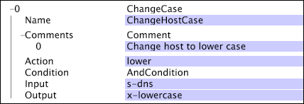

# ChangeCase{#changecase}

The ChangeCase transformation changes the case of the string in the Input parameter as specified by the Action parameter.

|  Parameter  | Description  | Default  |
|---|---|---|
|  Name  | Descriptive name of the transformation. You can enter any name here.  | |
|  Action  | Upper or lower. Specifies whether the case is to be changed to upper or lower.  | lower  |
|  Comments  | Optional. Notes about the transformation.  | |
|  Condition  | The conditions under which this transformation is applied.  | |
|  Input  | The name of the field from the log entry to use as input.  | |
|  Output  | The name of the output field.  | |

In this example, which uses fields of data collected from website traffic, the case of the string within the s-dns field is changed to lower case, and the new value is output in the new field, x-lowercase-dns.

