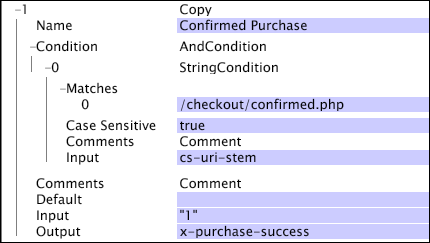

# Copy{#copy}

The Copy transformation simply copies the value in the input field to the given output field. If the input field could be a vector of strings, the output field must start with "x-."

|  Parameter  | Description  | Default  |
|---|---|---|
|  Name  | Descriptive name of the transformation. You can enter any name here.  | |
|  Comments  | Optional. Notes about the transformation.  | |
|  Condition  | The conditions under which this transformation is applied.  | |
|  Default  | Used if the condition test is true and the input value is not available in the given log entry.  | |
|  Input  | The name of the field from which to copy.  | |
|  Output  | The name of the output field.  | |

In this example, which uses fields of data collected from website traffic, the output field, x-purchase-success, is given the literal value of "1" each time cs-uri-stem matches [!DNL /checkout/confirmed.php]. If the [!DNL Condition] is not satisfied (that is, cs-uri-stem does not match [!DNL /checkout/confirmed.php]), x-purchase-success is not changed.

