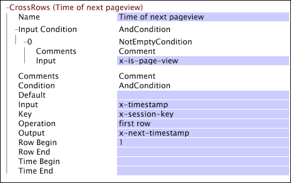

# CrossRows{#crossrows}

Like other transformations, the CrossRows transformation is applied to the rows of data (log entries) in your log sources.

 For each row of data, the transformation takes the value of the specified input field, performs a set of processing steps, and records the result in the output field that you specify. However, when the [!DNL CrossRows] transformation works on one row of data (this row is called the output row), it takes into account that row plus one or more other rows of data (these rows are called input rows) that are associated with the same tracking ID. Therefore, for a given tracking ID, the value of the output field for each output row is based on the values of the input field for one or more input rows.

The transformation provides multiple conditions and constraints that enable you to limit the input rows for the transformation. You can express these limits in terms of the data workbench server's conditions (see [Conditions](../../../../../home/c-dataset-const-proc/c-conditions/c-abt-cond.md)), a range of input rows relative to the output row, or a range of times relative to the time of the output row. For those input rows that satisfy the transformation's conditions and constraints, you can apply an operation (such as SUM) that determines the value of output field.

>[!NOTE]
>
>To work, the [!DNL CrossRows] transformation requires that the data is ordered in time and grouped by the tracking ID in your source data. Therefore, [!DNL CrossRows] works only when defined in the [!DNL Transformation.cfg] file or in a [!DNL Transformation Dataset Include] file.

As you review the descriptions of the parameters in the following table, remember the following:

* The output row is the row of data that the transformation is working on at a given point in time. 
* Input rows are all of the other rows of data (before, after, or including the output row) whose values of the input field serve as inputs to the transformation. Input rows are subject to the Input Condition, Key, Row Begin, Row End, Time Begin, and Time End parameters.

<table id="table_152851484AFF4C50AF736DC62FAA43E3"> 
 <thead> 
  <tr> 
   <th colname="col1" class="entry"> Parameter </th> 
   <th colname="col2" class="entry"> Description </th> 
   <th colname="col3" class="entry"> Default </th> 
  </tr> 
 </thead>
 <tbody> 
  <tr> 
   <td colname="col1"> Name </td> 
   <td colname="col2"> Descriptive name of the transformation. You can enter any name here. </td> 
   <td colname="col3"> </td> 
  </tr> 
  <tr> 
   <td colname="col1"> Comments </td> 
   <td colname="col2"> Optional. Notes about the transformation. </td> 
   <td colname="col3"> </td> 
  </tr> 
  <tr> 
   <td colname="col1"> Condition </td> 
   <td colname="col2"> Limits the output of the transformation to certain log entries. If the condition is not met for a particular log entry, the field in Output parameter is left unchanged. The input still may be used to affect other log entries. </td> 
   <td colname="col3"> </td> 
  </tr> 
  <tr> 
   <td colname="col1"> Input </td> 
   <td colname="col2"> The name of the field from the input row to use as input. </td> 
   <td colname="col3"> </td> 
  </tr> 
  <tr> 
   <td colname="col1"> Input Condition </td> 
   <td colname="col2"> Accepts input for the transformation from only certain input rows. If the Input Condition is not met for a particular input row, the input field from that row is ignored and does not affect other output rows. However, the output field from that row is still modified per the specified Condition. </td> 
   <td colname="col3"> </td> 
  </tr> 
  <tr> 
   <td colname="col1"> Key </td> 
   <td colname="col2"> 
Optional. The name of the field to use as the key. 
 
 If a key is specified, the input rows for a given output row are limited to the contiguous block of rows having the same Key value as the output row. This restriction is in addition to all other limitations placed on the input rows by other parameters of the  CrossRows transformation. 
 
 For example, if you are working with web data and you make the field x-session-key (which has a unique value for each session) the key, then the input rows for the transformation are limited to those rows having the same x-session-key value as the output row. Therefore, you are considering only those input rows representing page views that occur during the same session as the output row. 
 </td> 
   <td colname="col3"> </td> 
  </tr> 
  <tr> 
   <td colname="col1"> Operation </td> 
   <td colname="col2"> 
An operation that, for each output row, is applied to all of the input rows satisfying all of the conditions defined by the Input Condition, Key, Row Begin, Row End, Time Begin, and Time End parameters to produce an output: 
     <ul id="ul_C01CCF73A9544BCFB7B1105042FEF2DD"> 
      <li id="li_2D1A192970904499AB9F4431D51106D7"> ALL takes all of the values of the input field from the input rows and outputs them as a vector. </li> 
      <li id="li_B8863724AD924DE5BDBC987143548257"> SUM interprets the values of the input field from the input rows as numbers and sums them. </li> 
      <li id="li_BF930069DCEA4E0B80893C3C06CAE100"> FIRST ROW outputs the value of the input field from the first input row. </li> 
      <li id="li_04B9E2D88C0847E28101FC830C18D8E2"> LAST ROW outputs the value of the input field from the last input row. </li> 
     </ul> 
 </td> 
   <td colname="col3"> </td> 
  </tr> 
  <tr> 
   <td colname="col1"> Output </td> 
   <td colname="col2"> The name of the output field. </td> 
   <td colname="col3"> </td> 
  </tr> 
  <tr> 
   <td colname="col1"> Row Begin/Row End </td> 
   <td colname="col2"> 
Optional. Specifies a range of input rows relative to the output row. For example, a Row Begin value of "0" excludes all rows before the output row. A row begin value of "1" excludes the output row as well. Common ranges include: 
     <ul id="ul_B030F32A5146430BA50DD4FAB4A527B0"> 
      <li id="li_30DFB8C0265349C295943A1CB8077B86"> Begin 0: This row and all subsequent ones. </li> 
      <li id="li_9090C2E94E394351867BC5B78F27B41C"> Begin 1: All subsequent rows. </li> 
      <li id="li_F870DC913E3F45BA94EE2EC04D344DE0"> End 0: This row and all previous ones. </li> 
      <li id="li_B8A576E419744D84AB1298E5155B583E"> End -1: All previous rows. </li> 
      <li id="li_CD2307A262D34542A2860FF07005CAD7"> Begin -1, End -1: The previous row. </li> 
      <li id="li_6BF30B7BB7CC40A68B2332A3C11DD3B5"> Begin 1, End 1: The next row. </li> 
     </ul> 
 </td> 
   <td colname="col3"> All rows </td> 
  </tr> 
  <tr> 
   <td colname="col1"> Time Begin/Time End </td> 
   <td colname="col2"> 
Optional. Specifies a range of times relative to the time of the output row. For example, a Time End of 30 minutes includes all rows that take place within 30 minutes after the output row. A Time Begin of -30 minutes includes all rows that take place within 30 minutes before the output row. 
 
 Available time units are days, weeks, hours, minutes, ms (milliseconds), ticks (100 nanoseconds), and ns (nanoseconds). 
 </td> 
   <td colname="col3"> All times </td> 
  </tr> 
 </tbody> 
</table>

The [!DNL CrossRows] transformation in this example is applied to rows of web data to find for each page view the time of the next page view. Because we know that [!DNL CrossRows] is applied only during the transformation phase of the dataset construction process, the rows of data are ordered by visitor (each visitor has a unique tracking ID) and time.

The input field, x-timestamp, is considered for only those input rows in which the x-is-page-view field is populated (indicating the row of data represents a page view). The x-session-key field (which has a unique value for each session) is specified for the Key parameter. Therefore, the input rows (log entries) for the transformation are limited to the contiguous block of rows having the same value of x-session-key as the output row. In other words, to be considered for the transformation, an input row must represent a page view that occurs during the same session as the page view in the output row. The first row operation takes the value of the output field from the first input row satisfying the [!DNL Input] Condition and having the same x-session-key value as the output row.

[!DNL CrossRows] executes in an amount of time proportional to the size of its inputs plus the size of its outputs. This means that for operations SUM, FIRST ROW, and LAST ROW, it is no less efficient than other transformations. For ALL, the situation is more complex because it is possible to configure [!DNL CrossRows] to output an amount of data for each row of data (log entry) that is proportional to the total number of rows (log entries) for a given tracking ID.
