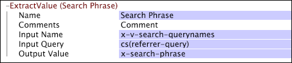

# ExtractValue{#extractvalue}

If you are working with web data, you can use the ExtractValue transformation to extract a value from a query string, cookie, or similarly encoded field in your website data.

Note that the name(s) corresponding to the value to be extracted can be different in each log entry.

<table id="table_D16A39BE035043628A4D6F7452952304"> 
 <thead> 
  <tr valign="top"> 
   <th colname="col1" class="entry"> Parameter </th> 
   <th colname="col2" class="entry"> Description </th> 
   <th colname="col3" class="entry"> Default </th> 
  </tr> 
 </thead>
 <tbody> 
  <tr valign="top"> 
   <td colname="col1"> Name </td> 
   <td colname="col2"> Descriptive name of the transformation. You can enter any name here. </td> 
   <td colname="col3"></td> 
  </tr> 
  <tr valign="top"> 
   <td colname="col1"> Comments </td> 
   <td colname="col2"> Optional. Notes about the transformation. </td> 
   <td colname="col3"></td> 
  </tr> 
  <tr valign="top"> 
   <td colname="col1"> Condition </td> 
   <td colname="col2"> The conditions under which this transformation is applied. </td> 
   <td colname="col3"></td> 
  </tr> 
  <tr valign="top"> 
   <td colname="col1"> Input Name </td> 
   <td colname="col2"> 
The name(s) of the field(s) to be extracted from the Input Query. 
 
 
Note:  If the Input Name is a vector (that is, there are multiple names present), only one value is extracted. 
 
 </td> 
   <td colname="col3"></td> 
  </tr> 
  <tr valign="top"> 
   <td colname="col1"> Input Query </td> 
   <td colname="col2"> The encoded mapping (query string, cookie, and so forth) from which the value is to be extracted. </td> 
   <td colname="col3"></td> 
  </tr> 
  <tr valign="top"> 
   <td colname="col1"> Output Value </td> 
   <td colname="col2"> The name of the field used to capture the extracted decoded value. </td> 
   <td colname="col3"></td> 
  </tr> 
 </tbody> 
</table>

If you want to extract a search phrase, you can extract the entire phrase and, if desired, split the phrase into search terms using a [!DNL Tokenize] transformation. For information about the [!DNL Tokenize] transformation, see [Tokenize](../../../../../home/c-dataset-const-proc/c-data-trans/c-transf-types/c-standard-transf/c-tokenize.md#concept-f460aa5df3a7476e971af29cf5d9b32c).

This example configures an [!DNL ExtractValue] transformation to extract values of the x-v-search-querynames field from cs(referrer-query) and store them in the x-search-phrase field.

