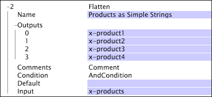

# Flatten{#flatten}

The Flatten transformation takes a vector of strings and maps each value into its own field.

|  Parameter  | Description  | Default  |
|---|---|---|
|  Name  | Descriptive name of the transformation. You can enter any name here.  |  |
|  Comments  | Optional. Notes about the transformation.  |  |
|  Condition  | The conditions under which this transformation is applied.  |  |
|  Default  | The default value to use if the condition is met and the input value is not available for the log entry.  |  |
|  Input  | A vector of string values to map to the output field names.  |  |
|  Outputs  | A set of output field names.  |  |

Considerations for [!DNL Flatten]

* If the input vector contains more values than there are defined output fields, the extra input values are simply dropped. 
* If the input vector contains fewer values than there are defined output fields, the extra output fields are given the default value (if defined) or an empty string if no default value is defined.

Here, the [!DNL Flatten] transformation is used to take a vector of products (x-products) and separate them into four fields (x-product1, ..., x-product4).

If the input value contained the strings B57481, C46355, and Z97123, the output fields would have the values shown here:

* x-product1 = B57481 
* x-product2 = C46355 
* x-product3 = Z97123 
* x-product4 = Empty (There are more inputs than outputs, and there is no default value specified.)

