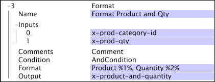

# Format{#format}

The Format transformation takes a set of inputs and formats them to create an output matching the given structure.

 The transformation works on either simple strings or string vectors and produces output by applying the given format to each input value until all of the input values have been transformed.

<table id="table_3953C993167248AA9A47964A51C4AB5D"> 
 <thead> 
  <tr> 
   <th colname="col1" class="entry"> Parameter </th> 
   <th colname="col2" class="entry"> Description </th> 
   <th colname="col3" class="entry"> Default </th> 
  </tr> 
 </thead>
 <tbody> 
  <tr> 
   <td colname="col1"> Name </td> 
   <td colname="col2"> Descriptive name of the transformation. You can enter any name here. </td> 
   <td colname="col3"></td> 
  </tr> 
  <tr> 
   <td colname="col1"> Comments </td> 
   <td colname="col2"> Optional. Notes about the transformation. </td> 
   <td colname="col3"></td> 
  </tr> 
  <tr> 
   <td colname="col1"> Condition </td> 
   <td colname="col2"> The conditions under which this transformation is applied. </td> 
   <td colname="col3"></td> 
  </tr> 
  <tr> 
   <td colname="col1"> Format </td> 
   <td colname="col2"> 
A formatting string used to specify how the output will look. 
 
 %1% refers to a value from the first input vector, %2% refers to a value from the second input vector, and so on. 
 </td> 
   <td colname="col3"></td> 
  </tr> 
  <tr> 
   <td colname="col1"> Inputs </td> 
   <td colname="col2"> 
Fields containing either simple strings or string vectors. In the case of string vectors as inputs, the output will also be a string vector resulting from the application of the  Format parameter to each set of input values. 
 
 
Note:  The numbering of inputs starts at 0, but the numbering of the format substitution values starts at %1%. 
 
 </td> 
   <td colname="col3"></td> 
  </tr> 
  <tr> 
   <td colname="col1"> Output </td> 
   <td colname="col2"> The name of the field created to contain the results of the transformation. If the inputs are string vectors, the length of the output string vector will be the length of the longest input vector. If some of the input string vectors are of shorter length, empty strings are used for their position in the format string until the length of the output vector is reached. </td> 
   <td colname="col3"></td> 
  </tr> 
 </tbody> 
</table>

In this example, two vectors, one a vector of strings representing product categories and the other a corresponding string vector representing the quantity of each product purchased, are transformed into a single vector of equivalent length that takes the form: Product %1%, Quantity %2%.

If the input vectors contained product categories of (683, 918) and quantities of (10, 4), the result would be one final output vector containing the following two strings: ("Product 683, Quantity 10", "Product 918, Quantity 4"). 
