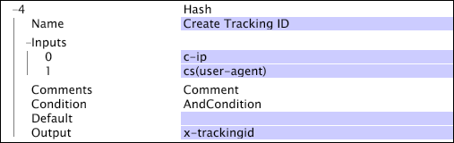

# Hash{#hash}

The Hash transformation creates a nearly unique string representing a 64-bit number from the input values.

 This transformation provides the same hash value when given the same inputs.

>[!NOTE]
>
>The resulting value is nearly unique because the transformation uses a 64-bit number as the space of possible hash values. For one million unique inputs to the [!DNL hash] transformation, there is a 1 in 38,000,000 chance of getting a duplicate hash value.

|  Parameter  | Description  | Default  |
|---|---|---|
|  Name  | Descriptive name of the transformation. You can enter any name here.  | |
|  Comments  | Optional. Notes about the transformation.  | |
|  Condition  | The conditions under which this transformation is applied.  | |
|  Default  | The default value to use if the input value is not available.  | |
|  Inputs  | The set of inputs to use to create the hash value.  | |
|  Output  | The name of the field for output.  | |

In this example, the values of the c-ip and cs(user-agent) fields are used to create a tracking ID, which is stored in the x-trackingid field.

>[!NOTE]
>
>This example does not represent an ideal solution for creating unique tracking IDs. However, in situations in which archival log information is used, it may be the best method.

