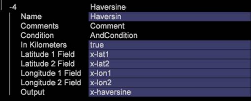

# Haversine{#haversine}

In mathematics, the haversine formula is an equation that gives circle distances between two points on a sphere identified from their longitudes and latitudes.

 Like the formula, the [!DNL Haversine] transform requires two sets of [!DNL Latitude] and [!DNL Longitude] settings, using these four inputs to calculate the true distance across the Earth between two locations.

This distance can be represented as miles or kilometers by changing the "In Kilometers" flag from false to true.

|  Parameter  | Description  | Default  |
|---|---|---|
|  Name  | Descriptive name of the transformation. You can enter any name here.  | |
|  Comments  | Optional. Notes about the transformation.  | |
|  Condition  | The conditions under which this transformation is applied.  | |
|  Latitude 1 Field  | The latitude of the point 1. | |
|  Latitude 2 Field  | The latitude of the point 2.  | |
|  Longitude 1 Field  | The longitude of the point 1. | |
|  Longitude 2 Field  | The longitude of the point 2.  | |
|  Output  |Once calculated, the [!DNL Output] field contains distances between the points designated as elements in a Dimension.  | |

As an example, if you code in a latitude and longitude of their store as Lat1, Lon1 and use an IP lookup lat and long for their customers, then distances to a store most customers buy from or come from can be determined.

>[!NOTE]
>
>If you want to identify distances for other locations, then each individual location must have its own set of lat and lon fields.

