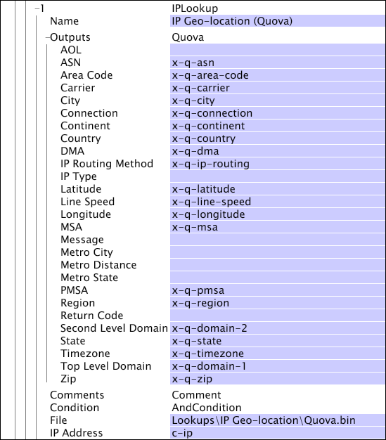

# IPLookup{#iplookup}

The IPLookup transformation takes IP geo-location or IP geo-intelligence data (provided by any vendor of such data and converted into a proprietary format by Adobe) and transforms the data into geographical information that can be used in analysis.

Two [!DNL IPLookup] transformations are listed in the Add new > *Transformation type *menu:

* [!DNL IPLookup] Quova for [!DNL IP geo-location] data 

* [!DNL IPLookup] Digital Envoy for [!DNL IP geo-intelligence] data

When defining an [!DNL IPLookup] transformation, choose the appropriate transformation for your [!DNL IP geo-location] or [!DNL IP geo-intelligence] data.

<table id="table_C438A30AB5E64160A5C486D6887B1D7E"> 
 <thead> 
  <tr valign="top"> 
   <th colname="col1" class="entry"> Parameter </th> 
   <th colname="col2" class="entry"> Description </th> 
   <th colname="col3" class="entry"> Default </th> 
  </tr> 
 </thead>
 <tbody> 
  <tr valign="top"> 
   <td colname="col1"> Name </td> 
   <td colname="col2"> Descriptive name of the transformation. You can enter any name here. </td> 
   <td colname="col3"> </td> 
  </tr> 
  <tr valign="top"> 
   <td colname="col1"> Comments </td> 
   <td colname="col2"> Optional. Notes about the transformation. </td> 
   <td colname="col3"> </td> 
  </tr> 
  <tr valign="top"> 
   <td colname="col1"> Condition </td> 
   <td colname="col2"> The conditions under which this transformation is applied. </td> 
   <td colname="col3"> </td> 
  </tr> 
  <tr valign="top"> 
   <td colname="col1"> File </td> 
   <td colname="col2"> Path and file name of the lookup file. Relative paths are with respect to the installation directory for the data workbench server. This file is typically located in the Lookups directory within the data workbench server installation directory. </td> 
   <td colname="col3"> </td> 
  </tr> 
  <tr valign="top"> 
   <td colname="col1"> IP Address </td> 
   <td colname="col2"> The field from which to read the IP address. </td> 
   <td colname="col3"> c-ip </td> 
  </tr> 
  <tr valign="top"> 
   <td colname="col1"> Outputs </td> 
   <td colname="col2"> 
The names of the output strings. 
 
 The  IPLookup Quova and  IPLookup Digital Envoy transformations have different output parameters. Be sure to use the appropriate transformation for your IP lookup data. 
 </td> 
   <td colname="col3"> </td> 
  </tr> 
 </tbody> 
</table>

In this example, [!DNL IP geo-location] data (in the lookup file [!DNL Quova.bin]) is used to create the output fields listed. The outputs (AOL, ASN, Area Code, and so on) can be used to create dimensions for geographical analysis of visitor traffic.

