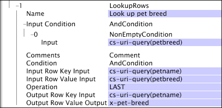

# LookupRows{#lookuprows}

The LookupRows transformation looks at other log entries with the same tracking ID and sets the value of the output field to the value of a designated field in the input row.

Because the [!DNL LookupRows] transformation performs its lookup on log entries and not lookup files, it is very similar to the [!DNL CrossRows] transformation. See [CrossRows](../../../../../home/c-dataset-const-proc/c-data-trans/c-transf-types/c-standard-transf/c-crossrows.md#concept-fcace08804f54db397ed631cc13ff4f2).

To work, the [!DNL LookupRows] transformation requires that the data is ordered in time and grouped by the tracking ID in your source data. Therefore, [!DNL LookupRows] works only when defined in the [!DNL Transformation.cfg] file or in a [!DNL Transformation Dataset Include] file.

As you review the descriptions of the parameters in the following table, remember the following:

* The output row is the row of data that the transformation is working on at a given point in time. 
* Input rows are all of the other rows of data (before, after, or including the output row) whose values of the input field serve as inputs to the transformation.

<table id="table_AB68A89ECD5C45F39B8433F994BBD7D8"> 
 <thead> 
  <tr valign="top"> 
   <th colname="col1" class="entry"> Parameter </th> 
   <th colname="col2" class="entry"> Description </th> 
   <th colname="col3" class="entry"> Default </th> 
  </tr> 
 </thead>
 <tbody> 
  <tr valign="top"> 
   <td colname="col1"> Name </td> 
   <td colname="col2"> Descriptive name of the transformation. You can enter any name here. </td> 
   <td colname="col3"> </td> 
  </tr> 
  <tr valign="top"> 
   <td colname="col1"> Comments </td> 
   <td colname="col2"> Optional. Notes about the transformation. </td> 
   <td colname="col3"> </td> 
  </tr> 
  <tr valign="top"> 
   <td colname="col1"> Condition </td> 
   <td colname="col2"> Limits the output of the transformation to certain log entries. If the condition is not met for a particular log entry, the field in Output Row Value Output parameter is left unchanged. The input still may be used to affect other log entries. </td> 
   <td colname="col3"> </td> 
  </tr> 
  <tr valign="top"> 
   <td colname="col1"> Input Condition </td> 
   <td colname="col2">Accepts input for the transformation from only certain input rows. If the  Input Condition is not met for a particular input row, the input field from that row is ignored and does not affect other output rows. However, the output field from that row is still modified per the specified Condition. </td> 
   <td colname="col3"> </td> 
  </tr> 
  <tr valign="top"> 
   <td colname="col1"> Input Row Key Input </td> 
   <td colname="col2"> The name of the field to use as the key for the input rows. </td> 
   <td colname="col3"> </td> 
  </tr> 
  <tr valign="top"> 
   <td colname="col1"> Input Row Value Input </td> 
   <td colname="col2"> The name of the field in the input row whose value is copied to the field in the Output Row Value Output parameter if all conditions are satisfied. </td> 
   <td colname="col3"> </td> 
  </tr> 
  <tr valign="top"> 
   <td colname="col1"> Operation </td> 
   <td colname="col2"> 
An operation that, for each output row, is applied to all of the input rows satisfying all of the conditions defined by the  Input Condition and Input Row Key Input parameters to produce an output: 
     <ul id="ul_16FB152CB558497794DDED72A2F05CDD"> 
      <li id="li_22DA9F814E4E42D0B21E90B63A2A7A0E"> FIRST outputs the value of the field in the Input Row Value Input parameter from the first matching input row in the data (not the first matching row after the output row). </li> 
      <li id="li_45E00C3DE0494A1CB5C09B942088F161"> LAST outputs the value of the field in the Input Row Value Input parameter from the last input row in the data (not the last matching row before the output row). </li> 
     </ul> 
 </td> 
   <td colname="col3"> </td> 
  </tr> 
  <tr valign="top"> 
   <td colname="col1"> Output Row Key Input </td> 
   <td colname="col2"> The name of the field to use as the key for the output row. </td> 
   <td colname="col3"> </td> 
  </tr> 
  <tr valign="top"> 
   <td colname="col1"> Output Row Value Output </td> 
   <td colname="col2">The name of the field in the output row whose value is copied from the field in the Input Row Value Input parameter if all conditions are satisfied. All output rows with the same x-trackingid and  Output Row Key Input values have the same  Output Row Value Output value. </td> 
   <td colname="col3"> </td> 
  </tr> 
 </tbody> 
</table>

The Input Row Key Input, Input Row Value Input, and Input Condition parameters together define the lookup file for each tracking ID, while the Output Row Key Input, Output Row Value Input, and Condition parameters control what is looked up in the file and what value is stored in the field specified by Output Row Value Output.

To better understand the operation of the transformation, consider the following outline:

* For each output row satisfying the Condition and having a nonempty Output Row Key Input:

    * Find the FIRST or LAST input row such that

        * the input row satisfies the Input Condition, and 
        * the x-trackingid of the input row equals the x-trackingid of the output row, and 
        * the Input Row Key Input of the input row equals the Output Row Key Input of the output row,

* and set the Output Row Value Output of the output row to the Input Row Value Input of the input row.

Considerations for [!DNL LookupRows]

* Blank key values never match anything. Even if there are input rows with blank keys and nonblank values that match the [!DNL Input Condition], an [!DNL Output Row Key Input] of "" will always produce an [!DNL Output Row Value Output] of "". 

* If not forbidden by the [!DNL Input Condition], a row may look up itself if its [!DNL Input Row Key Input] and [!DNL Output Row Key Input] values are the same.

If you have multiple key values, you can combine them using a [!DNL Format] transformation (see [Format](../../../../../home/c-dataset-const-proc/c-data-trans/c-transf-types/c-standard-transf/c-format.md#concept-3de04869181e4694ab072b092186684b)) before applying a [!DNL LookupRows] transformation.

Suppose that you have a website that has a pet registration page, where the name and the breed are entered, and a later "buy toy" page where only the name of the pet is used. You would like to be able to link the pet name with the pet breed entered on the registration page. To do so, you could create the following [!DNL LookupRows] transformation:

Let's analyze this example using the previous outline:

* For each output row satisfying having a nonempty value of cs-uri-query(petname) :

    * Find the LAST input row such that

        * the input row contains a nonempty value of cs-uri-query(petbreed), and 
        * the x-trackingid of the input row equals the x-trackingid of the output row, and 
        * the value of cs-uri-query(petname) of the input row equals the value of cs-uri-query(petname) of the output row,

* and set the value of x-pet-breed of the output row to the value of cs-uri-query(petbreed) of the input row.

The [!DNL LookupRows] transformation uses the pet name (the key) to make sure that the pet breed is linked to both the pet registration and buy toy pages so that you can analyze the toys bought for each breed of pet, even for visitors with multiple pets. 
