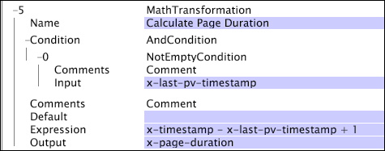

# Math{#math}

The Math transformation enables the use of arithmetic operations on fields within the log entries.

 The operations can include decimal integers and floating point constants.

<table id="table_FDF3DDF1960E43E391A67C9DC2A0E302"> 
 <thead> 
  <tr> 
   <th colname="col1" class="entry"> Field </th> 
   <th colname="col2" class="entry"> Description </th> 
   <th colname="col3" class="entry"> Default </th> 
  </tr> 
 </thead>
 <tbody> 
  <tr> 
   <td colname="col1"> Name </td> 
   <td colname="col2"> Descriptive name of the transformation. You can enter any name here. </td> 
   <td colname="col3"></td> 
  </tr> 
  <tr> 
   <td colname="col1"> Comments </td> 
   <td colname="col2"> Optional. Notes about the transformation. </td> 
   <td colname="col3"></td> 
  </tr> 
  <tr> 
   <td colname="col1"> Condition </td> 
   <td colname="col2"> The conditions under which this transformation is applied. </td> 
   <td colname="col3"></td> 
  </tr> 
  <tr> 
   <td colname="col1"> Expression </td> 
   <td colname="col2"> 
An arithmetic expression that describes the computation to be performed. 
 
 You can use any of the operations and functions listed below, and you can incorporate field names in the expression: 
 
 Operations 
     <ul id="ul_DB5915FADA0A41A3B11F1F48615F40A9">
      <li id="li_CA9EA97243F04760A81313C17EE057B3"> Addition (+) </li>
      <li id="li_908A272EBA2340098C20F22AA8D9ED26"> Subtraction (-) </li>
      <li id="li_C62257FF3AAB436D9148BBEA441621D7"> Multiplication (*) </li>
      <li id="li_B5A9EAB3E49D4CB9A297172199F23542"> Division (/) </li>
      <li id="li_D2D2B51DB2C8412A9B6F9D5F3CC03F8A"> Remainder (%) </li>
      <li id="li_07E7E368FFD2437A852B785E159848E5"> Exponentiation (^) </li>
     </ul>
 
Functions 
     <ul id="ul_E335AE8D684340AA998C4A2633FFDEE1">
      <li id="li_E036FF0B5DF244DDBFEDA9BFEDC62251"> sgn(x). Returns 1 if x is positive, 0 if x is zero, or -1 if x is negative. </li>
      <li id="li_90CD8899DDC14778A95930C2768C82BC"> abs(x). Returns the absolute value of x. </li>
      <li id="li_F4AF23F343F74BD88B7166B1C2BB065E"> floor(x). Returns the greatest integer less than or equal to x. </li>
      <li id="li_A31379A3659240C3A629BFAF19A6DDF1"> round(x). Returns the nearest integer to x. </li>
      <li id="li_9C0A0F3A4A304026B543F2A64B98B922"> log(b,x). Returns the logarithm of x base b. </li>
      <li id="li_124D62C2CA5A42CBBCC5DB18FAA8920E"> min(x,y,...). Returns the smallest of all its arguments. </li>
      <li id="li_3B7B9FC1C0BF4E7688F9F49130B97B7F"> max(x,y,...). Returns the largest of all its arguments. </li>
     </ul>
 </td> 
   <td colname="col3"></td> 
  </tr> 
  <tr> 
   <td colname="col1"> Output </td> 
   <td colname="col2"> The name of the field containing the result of the arithmetic operation. </td> 
   <td colname="col3"></td> 
  </tr> 
 </tbody> 
</table>

In this example, which uses fields of data collected from website traffic, a new field named x-page-duration is calculated by subtracting x-last-pv-timestamp from x-timestamp, then adding 1. The output is calculated only if the user-defined field x-last-pv-timestamp (which represents the timestamp of a visitor's last page view), is populated, or "not empty."

For information about the [!DNL Not Empty] condition, see [Conditions](../../../../../home/c-dataset-const-proc/c-conditions/c-abt-cond.md).
