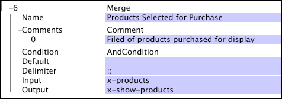

# Merge{#merge}

The Merge transformation takes the values from the input field (typically a vector of strings), combines them into a single string separated by the given delimiter, and places the resulting string in the given output field.

<table id="table_2458E008C9A14B31A774E6819D07E9BE"> 
 <thead> 
  <tr valign="top"> 
   <th colname="col1" class="entry"> Parameter </th> 
   <th colname="col2" class="entry"> Description </th> 
   <th colname="col3" class="entry"> Default </th> 
  </tr> 
 </thead>
 <tbody> 
  <tr valign="top"> 
   <td colname="col1"> Name </td> 
   <td colname="col2"> Descriptive name of the transformation. You can enter any name here. </td> 
   <td colname="col3"></td> 
  </tr> 
  <tr valign="top"> 
   <td colname="col1"> Comments </td> 
   <td colname="col2"> Optional. Notes about the transformation. </td> 
   <td colname="col3"></td> 
  </tr> 
  <tr valign="top"> 
   <td colname="col1"> Condition </td> 
   <td colname="col2"> The conditions under which this transformation is applied. </td> 
   <td colname="col3"></td> 
  </tr> 
  <tr valign="top"> 
   <td colname="col1"> Default </td> 
   <td colname="col2"> The default value to use if the condition is met and the input value is not available. </td> 
   <td colname="col3"></td> 
  </tr> 
  <tr valign="top"> 
   <td colname="col1"> Delimiter </td> 
   <td colname="col2"> 
String that is used to separate the individual elements of the input string vector in the single output string. 
 
 If you hold down the Ctrl key and right-click within the Delimiter parameter, an  Insert menu appears. This menu contains a list of special characters that often are used as delimiters. 
 </td> 
   <td colname="col3"></td> 
  </tr> 
  <tr valign="top"> 
   <td colname="col1"> Input </td> 
   <td colname="col2"> A vector of string values that are combined to form the output string. </td> 
   <td colname="col3"></td> 
  </tr> 
  <tr valign="top"> 
   <td colname="col1"> Output </td> 
   <td colname="col2"> The name of the output string. </td> 
   <td colname="col3"></td> 
  </tr> 
 </tbody> 
</table>

In this example, an input vector of strings is assumed to contain a set of products that were selected for purchase. These products are placed into a single output string and are separated by "::" (two colons).

So if the input field x-products contained the string values B57481, C46355, and Z97123, the resulting output string x-show-products would be B57481::C46355::Z97123. 
