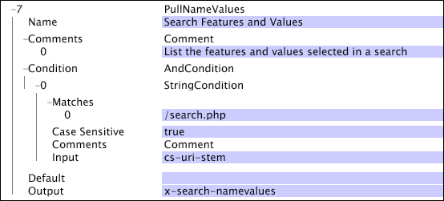

# PullNameValues{#pullnamevalues}

The PullNameValues transformation is a special operation that takes the values in the cs-uri-query field and separates each of the name-value pairs into a separate string.

 The entire collection of name-value pair strings is output in the specified output field as a vector of strings.

|  Parameter  | Description  | Default  |
|---|---|---|
|  Name  | Descriptive name of the transformation. You can enter any name here.  |  |
|  Comments  | Optional. Notes about the transformation.  |  |
|  Condition  | The conditions under which this transformation is applied.  |  |
|  Default  | The default value to use if the condition is met and the input value is not available in the given log entry.  |  |
|  Output  | The name of the output string.  |  |

The [!DNL PullNameValues] transformation is used in this example to capture visitors' use of the search form: which buttons were selected, what values were typed in the form, and so on. The example uses a [!DNL String Match] condition (see [Conditions](../../../../../home/c-dataset-const-proc/c-conditions/c-conditions.md#concept-9a576a00d5db48e7a599016c441e39e0)) to isolate the use of this transformation to only the page [!DNL /search.php]. The vector of name-value pairs is output into the field x-search-namevalues.

Using the transformation as defined above, if the cs-uri-stem field matched the page [!DNL /search.php] and cs-uri-query contained the following:

* Searchfor=Bob&State=Virginia&isMale=true

then x-search-namevalues would contain a vector containing the following three strings:

* Searchfor=Bob 
* State=Virginia 
* isMale=true

